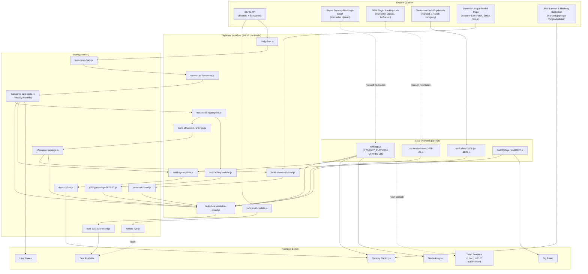

# 🌮 Taco Tuesday HQ

**Live:** https://pizzaratops.github.io/Taco-Tuesday-HQ/

Fantasy-Basketball-Hub für eine 12-Team H2H 9-Category Dynasty-Liga auf ESPN Fantasy Basketball. Dynasty Rankings, Team-Rosters, Trade-Analyse, Draft-Tools, Standings-Historie, Live Scores und mehr — alles automatisiert über GitHub Pages + GitHub Actions.

---

## 📌 Zuletzt gemacht

- **CSV-Export-Button** bei Weekly/Monthly Live Scores — lädt exakt das herunter, was gerade auf dem Bildschirm steht (aktuelle Sortierung + Min.-Spiele-Filter), nicht die ungefilterten Rohdaten.
- **Merge-Fix:** Workflow-Datei war in zwei parallelen Chats unabhängig voneinander geändert worden (robusterer Cron-Zeitplan in einem, korrigierte Schritt-Reihenfolge im anderen) — zusammengeführt, beide Verbesserungen jetzt zusammen live.

- **MFHFBs Dynasty Ranking neu aufgesetzt:** `data/rankings.js` ist jetzt Beyaz' eigenständiges Ranking (764 Spieler), **nicht mehr mit Matt Lawson geblendet**. Matt Lawsons Rangliste bleibt als separate Vergleichsquelle auf der Dynasty-Rankings-Seite bestehen (`MATT_RANKS`), fließt aber nicht mehr in `DYNASTY_PLAYERS` selbst ein. Trade Analyzer und alle anderen Verbraucher lesen `DYNASTY_PLAYERS` weiterhin live, keine Code-Änderung nötig — die neuen Werte greifen automatisch überall.
- **Best Available zeigt nur noch MFHFBs eigenen Dynasty-Rang** — Matt-DR- und Hashtag-Vergleichsspalten wurden dort entfernt (bleiben aber auf der Dynasty-Rankings-Seite selbst sichtbar).
- **Neue Platzhalter-Spalten "2026/27 Rankings" und "2026/27 Projections"** in Best Available — aktuell beide leer, Datenquelle noch zu klären.
- **Best Available komplett neu gebaut:** ein einziger gewichteter Score aus Dynasty-Rang, BBM-Redraft-Rang, letzter Saison (2025/26), Off-Season/Preseason und laufender Saison (schaltet sich automatisch scharf, sobald die reguläre Saison Daten liefert). Für Rookies zusätzlich Pre-Draft Big Board + echte Draft Capital + Sticky Score.
- **Post-Draft Board** für die komplette 2026er Draft-Klasse (56 Spieler), täglich neu berechnet.
- **ESPN-Roster-Sync automatisiert** — lief vorher nur über einen manuellen Admin-Knopf, jetzt Teil des täglichen Workflows (`data/rosters-live.js`).
- **Dynasty Live Nudge:** kleines Badge auf der Dynasty-Rankings-Seite, zeigt eine gedeckelte automatische Bewegung basierend auf aktueller Performance — verändert NICHT den manuellen Rang in `data/rankings.js`.
- **Alter für (fast) alle Spieler ergänzt:** BBM-Datei mit `age`-Spalte (letzte Saison) + Tankathon-Daten für die 2026er Rookies als Fallback.
- **Rookie/Sophomore/Every-Player-Filter** + saubere fortlaufende Nummerierung in Best Available (vorher Lücken, weil rostered Spieler rausgefiltert wurden).
- **Turnover aus "Beste/Schwächste Kategorie"** entfernt (auf Wunsch, da meist irrelevant für Waiver-Entscheidungen).
- **Sticky Score** aus [Pizzaratops/Summer-League-Modell](https://github.com/Pizzaratops/Summer-League-Modell) live eingebunden (gleiche Formel, kein Kopie-Drift).
- **Min.-Spiele-Slider (1–5)** bei Weekly/Monthly Live Scores, rein client-seitig.
- **Diverse Bugfixes:** falscher Require-Pfad in mehreren Scripts (stale Duplikat von `aggregate-core.js` ohne Off-Season-Regel → Weekly/Monthly zeigten zu wenig Spieler), Datums-Bug in `daily-9cat.js` (UTC statt Pacific-Zeit → Summer-League-Abfrage lief systematisch einen Tag zu früh), Cron-Zeiten von `:00` auf `:07` verschoben (GitHub-Lastspitzen), 22-Uhr-Lauf als echter Korrektur-Check umgebaut (fragt nochmal den gestrigen statt den heutigen Tag ab).
- **Draft Duel deaktiviert** (auskommentiert, nicht gelöscht) bis die 2027er Prospects da sind.

## 🔜 Als Nächstes (bis Saisonbeginn 2026/27)

1. **Liga-Wechsel im Workflow:** `LEAGUE_ARG`-Default von `nba-summer-las-vegas` auf `nba-preseason` (September) und dann `nba` (Oktober) umstellen.
2. **Tagesgrenze auf US-Eastern statt Pacific:** Der Pacific-Fix war Summer-League-spezifisch (nur Kalifornien/Utah/Vegas). Sobald die reguläre Saison über alle US-Zeitzonen läuft, ist Eastern die branchenübliche Referenz.
3. **BBM-Datei erneut hochladen**, sobald sie die 2026er-Rookies enthält (Alter + echte Season-Stats statt nur Tankathon-Fallback).
4. **Team Analytics automatisieren** — aktuell noch eine komplett statische Momentaufnahme (`js/analytics.js`, `AN_ROSTER` hardcoded).
5. **Draft Duel reaktivieren**, sobald 2027er Prospects verfügbar sind.
6. **"2026/27 Projections"-Spalte** in Best Available hat noch keine Datenquelle — bleibt leer, bis geklärt ist, woher Projections kommen sollen.
7. **Aufräumen:** doppelte `draft-capital-2026.js` (liegt sowohl in `scripts/` als auch `data/` — nur die Version in `data/` wird gebraucht), eine verrutschte `daily-9cat.js` in `.github/workflows/` (gehört nach `scripts/`, liegt dort auch schon korrekt), sowie drei weitere Verrutscher in `js/`: `build-postdraft-board.js` (gehört nach `scripts/`), `draft2026.js` und `draft2027.js` (gehören nach `data/`) — alle drei sind identische Kopien der korrekten Dateien, können einfach aus `js/` gelöscht werden. ~88 Spieler in `data/rankings.js` (v.a. tiefe 2026er Draft-Picks) haben noch keine Positions-Angabe, da sie weder in der xlsx noch im Pre-Draft Big Board mit Position auftauchen.

---

## 🗺️ Architektur & Datenfluss

Was mit was verknüpft ist, was automatisch läuft und was nicht — als Nachschlagewerk für uns beide.



### Verknüpfungsmatrix

| Seite | Datenquelle(n) | Automatisch? |
|---|---|---|
| **Dynasty Rankings** | `rankings.js` (MFHFBs DR) + `dynasty-live.js` (Live-Nudge-Badge) + `MATT_RANKS`/`hashtag.js` (Vergleichsspalten) | Rang selbst: manuell · Live-Nudge: automatisch |
| **Best Available** | `best-available-board.js` (alle Signale gebündelt) gegen `rosters-live.js` gefiltert | komplett automatisch |
| **Trade Analyzer** | `rankings.js` live | folgt manuellen Updates sofort, keine eigene Automatisierung nötig |
| **Live Scores** | `livescores-daily.js` + `livescores-aggregate.js` | komplett automatisch |
| **Big Board** | `draft2026.js` / `draft2027.js` | manuell (neuer Draft-Jahrgang = neue Datei) |
| **Team Analytics** | statisches `AN_ROSTER` in `js/analytics.js` | ⚠️ **nicht automatisiert**, siehe "Als Nächstes" |
| **Draft Duel** | `js/draft-duel.js` | deaktiviert bis 2027er Prospects da sind |

### Was in `best-available-board.js` alles zusammenfließt

Das ist der Knotenpunkt mit den meisten Quellen — einmal explizit aufgeschlüsselt:

| Signal | Quelle | Gewicht im Score | Auch als eigene Spalte sichtbar? |
|---|---|---|---|
| Dynasty-Rang | `rankings.js` | 0.35 | ✅ "MFHFBs DR" |
| BBM-Redraft-Rang | `FA_PLAYERS` in `best-available.js` | 0.15 | nein |
| Letzte Saison | `last-season-stats-2025-26.js` (Fallback: `rolling-rankings.js`) | 0.20 | nein (fließt in MIN/Kat. ein) |
| Off-Season | `offseason-rankings.js` | 0.15 | nein (fließt in MIN/Kat. ein) |
| Laufende Saison | `livescores-aggregate.js`, Liga `nba` | 0.35 (nur wenn Saison läuft) | nein (fließt in MIN/Kat. ein) |
| Post-Draft (Rookies) | `postdraft-board.js` | 0.30 | ✅ "Sticky" (Sticky Score allein) |
| 2026/27 Saison-Rang | `rolling-rankings-2026-27.js` | **nicht** in den Score gerechnet (Doppelzählung mit "Laufende Saison" vermeiden) | ✅ "2026/27 Rankings" |


Reines Vanilla-JS + HTML/CSS, keine Build-Tools, kein Framework. Gehostet auf GitHub Pages, Datenpipeline läuft über GitHub Actions + Node.js-Scripts.

## 📁 Projektstruktur

```
index.html              Single-Page-App, alle Seiten als <div class="page">
css/                     Styles
js/                      Frontend-Logik (eine Datei pro Feature-Bereich)
data/                    Datendateien — teils statisch (von Hand gepflegt),
                         teils automatisch generiert (siehe unten)
scripts/                 Node-Scripts für die tägliche GitHub Action
scripts/lib/              └ stale Duplikat von aggregate-core.js, nicht mehr verwenden
scripts/data/            └ tägliche ESPN-Boxscore-CSVs (Rohdaten, per Workflow committed)
.github/workflows/       Die tägliche Automatisierung
```

### Wichtige Datendateien

| Datei | Quelle | Update |
|---|---|---|
| `data/rankings.js` (`DYNASTY_PLAYERS`) | manuell kuratiert (Beyaz, eigenständig — nicht mehr mit Matt Lawson geblendet) | von Hand |
| `data/rosters-live.js` | ESPN API | täglich automatisch |
| `data/livescores-daily.js` / `-aggregate.js` | ESPN Boxscores | täglich automatisch |
| `data/offseason-rankings.js` | Summer League + Preseason CSVs | täglich automatisch |
| `data/postdraft-board.js` | Big Board + Draft Capital + Off-Season + Sticky Score | täglich automatisch |
| `data/best-available-board.js` | alle Signale kombiniert | täglich automatisch |
| `data/dynasty-live.js` | aktuelles Performance-Signal | täglich automatisch |
| `data/last-season-stats-2025-26.js` | BBM-Export | einmal pro Saison, manuell |
| `data/draft-class-2026.js` / `-2025.js` | Tankathon | einmalig pro Draft-Jahrgang, manuell |
| `data/rolling-rankings.js` | historisch (2025/26 EOS-Ränge) | statisch |
| `data/rolling-rankings-2026-27.js` | laufende Saison | täglich automatisch |
| `data/draft2026.js` / `draft2027.js` | Pre-Draft Big Boards | manuell |
| `data/hashtag.js` | Hashtag Basketball Rankings | manuell (externe Quelle) |

## ⚙️ Die tägliche Automatisierung

`.github/workflows/daily-9cat.yml` läuft 3× täglich (6/8/22 Uhr Berlin, DST-sicher über sechs Cron-Einträge + Zeit-Check-Step). Reihenfolge:

1. **ESPN Rosters synchronisieren** (`sync-espn-rosters.js`) — ersetzt den früheren manuellen Admin-Knopf
2. **Tagesdaten von ESPN holen** (`daily-9cat.js`) — der 22-Uhr-Lauf fragt bewusst den *gestrigen* statt heutigen Tag ab (Korrektur-Check für nachträgliche Boxscore-Änderungen)
3. **In `livescores-daily.js` konvertieren**
4. **Weekly/Monthly aktualisieren** (`update-all-aggregates.js`)
5. **Off-Season-Rankings fortschreiben**
6. **Post-Draft Board fortschreiben**
7. **Rolling-Rankings-Archiv fortschreiben** (muss vor Best Available laufen, da dieses davon liest)
8. **Best Available Board fortschreiben**
9. **Dynasty Live Nudge fortschreiben**
10. **Committen & pushen** (nur wenn sich tatsächlich was geändert hat)

Manueller Trigger jederzeit möglich über den "Run workflow"-Button (Actions-Tab → Daily 9cat Live Scores → Run workflow), optional mit eigenem Datum/Liga.

## 🧑‍💻 Lokal testen

```bash
node scripts/build-best-available-board.js   # z.B. einzelnes Script testen
node --check <datei>                          # Syntax-Check vor jedem Commit
```

Alle Build-Scripts sind idempotent und schreiben nur nach `data/` — kein Risiko, etwas kaputt zu machen, einfach nochmal laufen lassen.

## 📝 Konventionen

- Deutschsprachige UI, keine Bindestriche (Bindestriche) in deutschen UI-Texten
- Keine Emojis in Datentabellen
- Keine Inline-Kommentare in generiertem Code, aber ausführliche Header-Kommentare in jeder Datei
- `normalizeName()` (siehe `data/aliases.js`) für alle Namens-Abgleiche zwischen Datenquellen — ESPN/BBM/Tankathon schreiben Namen unterschiedlich
