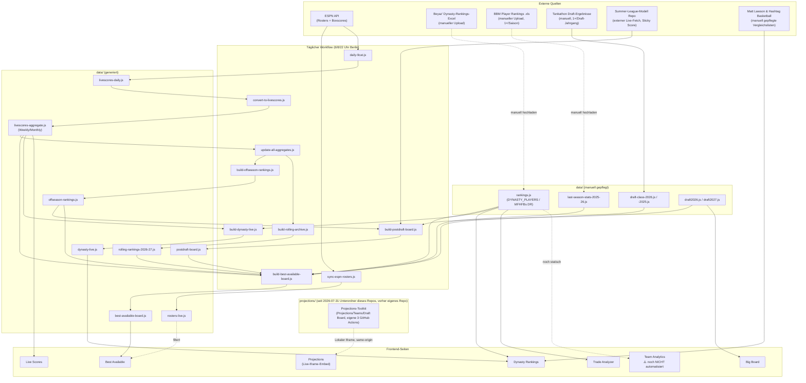

# 🌮 Taco Tuesday HQ

**Live:** https://pizzaratops.github.io/Taco-Tuesday-HQ/

Fantasy-Basketball-Hub für eine 12-Team H2H 9-Category Dynasty-Liga auf ESPN Fantasy Basketball. Dynasty Rankings, Team-Rosters, Trade-Analyse, Draft-Tools, Standings-Historie, Live Scores und mehr — alles automatisiert über GitHub Pages + GitHub Actions.

---

## 📌 Zuletzt gemacht

- **Theme-Flacker-Bug behoben + eigene Nav-Eintraege fuer NBA Teams/Draft Board (2026-07-31, 3. Nachbesserung):** Beim Wechsel Dark→Light zeigte die eingebettete Projections-Seite kurz einen "kaputt" wirkenden Zwischenzustand (Body noch dunkel, Tabellen-Wrapper schon hell) — Ursache war eine 150ms-Farb-Ueberblendung auf `body{transition:background-color 0.15s, color 0.15s}` in `projections/index.html`/`teams.html`/`draft.html`, waehrend andere Elemente (z.B. `.table-wrap`) ohne Transition sofort umschalten. Per Pixel-Messung am Screenshot bestaetigt (Body-Hintergrund exakt `#0f1117` = Dark-`--bg`, direkt daneben Tabellen-Wrapper exakt `#ffffff` = Light-`--surface`, gleichzeitig). Fix: Transition komplett entfernt, Wechsel jetzt atomar/sofort wie ueberall sonst in TTHQ. — Ausserdem auf Beyaz' Wunsch "NBA Teams" und "Draft Board" jetzt eigene Player-Dropdown-Eintraege statt nur interner Navigation innerhalb des Projections-Iframes (Muster uebernommen von der "Draft"-Dropdown-Jahres-Label-Struktur: neuer Abschnitt "Live Projections (Test)" mit 3 Eintraegen). Dafuer 2 neue Seiten/Iframes (`liveProjTeamsPage`/`projTeamsFrame` → `projections/teams.html`, `liveProjDraftPage`/`projDraftFrame` → `projections/draft.html`), `js/player-rankings.js` von Single-Iframe- auf generische Multi-Iframe-Logik umgebaut (`LIVE_PROJ_EMBEDS`-Map, ein Satz Lade-/Resize-Funktionen fuer alle 3), `js/theme.js` synct jetzt an alle 3 (nur die bereits geladenen). Interne Navigation innerhalb der eingebetteten Seiten bleibt zusaetzlich bestehen (unveraendert), jetzt einfach ein zweiter, redundanter Weg dorthin.
- **Projections-Seiten getauscht + Heatmap-Farbfix (2026-07-31, 2. Nachbesserung):** "2026/27 Projections" ist jetzt bewusst leer (Platzhalter-Hinweis, keine Datenquelle) — der MFHFBs-Toolkit-Iframe lebt stattdessen unter "Live Projections (Test)", das dort **die vorherige native TTHQ-Baseline+Blend-Preview-Tabelle komplett ersetzt** (Entscheidung von Beyaz). `js/live-projections-ui.js` ist deshalb jetzt unangebunden (Script-Include in `index.html` auskommentiert, Datei bleibt bestehen — gleiches Prinzip wie beim Draft-Duel-Block). Iframe-Element (`id="projectionsFrame"`) ist von `playerProjectionsPage` nach `liveProjectionsPage` umgezogen, `js/player-rankings.js` entsprechend angepasst (`showLiveProjections()` traegt jetzt die komplette Iframe-Lade-/Resize-Logik, `showPlayerProjections()` navigiert nur noch zur leeren Seite). Internes Navigieren zwischen Projections/NBA Teams/Draft Board bleibt wie gehabt innerhalb des Iframes, kein zusaetzlicher Player-Dropdown-Eintrag noetig (Entscheidung von Beyaz). Zusaetzlich: die Tabellen-Heatmap in `projections/assets/shared.js` (`mfhfbHeatStyle`) nutzte einen hartcodierten HSL-Regenbogen (rot->gruen ueber alle Zwischentoene, theme-unabhaengig) statt TTHQs Farben — sah dadurch "verwaschen"/inkonsistent aus. Jetzt lineare RGB-Interpolation zwischen den CSS-Variablen `--bad` und `--good`, live per `getComputedStyle` ausgelesen, bleibt automatisch mit dem Theme synchron.
- **Projections-Toolkit optisch an TTHQ angeglichen (2026-07-31, 1. Nachbesserung):** nach dem Merge fielen 3 Inkonsistenzen auf: (1) eigene Farbpalette der Projections-Seiten (kühles Blau/Grau) statt TTHQ's warmer Cream/Rost-Palette — alle `--bg/--surface/--surface2/--border/--text/--muted/--accent/--accent2/--good/--warn/--bad`-Werte in `projections/index.html`, `teams.html`, `draft.html` jetzt 1:1 auf TTHQ's eigene Tokens aus `css/style.css` gesetzt (Dark UND Light), reine Farbwert-Änderung, keine Strukturänderung. (2) doppeltes Scrollen — der Iframe war auf Viewport-Höhe gedeckelt und scrollte dadurch zusätzlich zur äußeren Seite intern; da der Iframe seit dem Merge same-origin ist, liest `js/player-rankings.js` jetzt die echte Inhaltshöhe aus (`contentDocument.documentElement.scrollHeight`) und setzt die Iframe-Höhe exakt darauf — plus `ResizeObserver` auf den Iframe-Body, damit Filter-/Sortier-Änderungen die Höhe live nachziehen. Nur noch die TTHQ-Seite scrollt, wie überall sonst. (3) doppelter Theme-Toggle-Button innerhalb des Embeds entfernt (konnte die äußere TTHQ-Chrome vom Iframe-Inhalt desynchronisieren, weil er direkt in `mfhfb_theme_v1` schrieb, ohne die äußere TTHQ-Theme über den `postMessage`-Sync zu informieren) — der äußere Dark/Light-Button oben steuert jetzt beides. Der Admin-Button *innerhalb* des Embeds bleibt bewusst bestehen: eigenes, unabhängiges Passwort-System nur für die Minuten-/Gewichtungs-Bearbeitung in der Projections-Seite, keine Dopplung von TTHQ-Admin.
- **MFHFBs-NBA-Projections komplett übernommen (2026-07-31):** der eigenständige Projections-Toolkit (`index.html` Projections-Tabelle, `teams.html` Minuten-Eingabe/Quelle der Wahrheit, `draft.html` Live-Draft-Tracker) lebt jetzt unverändert als Unterordner `projections/` in diesem Repo — nur noch ein Projekt statt zwei. Eigene Daten (`projections/data/`), eigene Build-Skripte (`projections/scripts/`) und eigene 3 GitHub Actions (`projections-fetch-draft-results.yml`, `projections-update-adp.yml`, `projections-update-rosters.yml`, alle mit `working-directory: projections` bzw. `projections/`-Pfaden im Commit-Schritt) sind 1:1 mitgekommen, keine Logikänderung. Die "Player → Projections"-Seite lädt den Iframe jetzt lokal (`projections/index.html` statt der externen GitHub-Pages-URL) — same-origin, dadurch läuft der Theme-Sync jetzt über `window.location.origin` statt der alten externen Domain. Interne Navigation innerhalb des Iframes (Projections ↔ NBA Teams ↔ Draft Board) funktioniert unverändert über relative Links. Das alte externe Repo kann jetzt archiviert werden, sobald sich der lokale Stand ein paar Tage bewährt hat. **Offen:** die separate "Live Projections (Test)"-Seite (eigene TTHQ-Baseline+Blend-Berechnung, siehe unten) bleibt bewusst unangetastet parallel bestehen, Entscheidung über deren Zukunft vertagt.
- **Season-Start-Plan "Projections-Flow" gebaut und getestet (noch nicht live geschaltet):** `scripts/import-projections-baseline.js` (Preseason-Baseline-Import aus xlsx) + `scripts/build-live-projections.js` (blendet Baseline mit den echten Saison-Stats aus den täglichen CSVs) + `js/live-projections-ui.js` mit neuer Seite `liveProjectionsPage` (sortierbare/durchsuchbare Tabelle, Status-Badge LIVE/BASELINE pro Spieler). FG%/FT% werden korrekt über geblendete Makes/Attempts berechnet, nicht als Prozent-Mittelwert. Mit echten Daten getestet (Cedric Coward/Jalen Slawson, `nba-summer-las-vegas`-Boxscores als Stand-in) — Ergebnis von Hand nachgerechnet, stimmt exakt. Testweise unter "Player" → "🧪 Live Projections (Test)" erreichbar, `data/projections-baseline.js`/`data/live-projections.js` bewusst leer committet. Details, offene Schritte bis zur echten Umschaltung: siehe eigene Sektion "🔮 Season-Start-Plan: Projections-Flow" weiter oben.
- **Trade Calculator gegen Matt Lawsons Trade Values gegengecheckt:** Spearman-Rangkorrelation zwischen Matt Lawsons Punktesystem (`ALL_ACCESS_-_BETA_-_NBA_Dynasty_Trade_Calculator`, "Values"-Sheet, 525 Spieler) und unserem `data/rankings.js`: **0.97** in den Top 300, **0.94** über alle 525 gematchten Spieler (525/525 Namen matchen 1:1 über `NAME_ALIASES`). Top 10 beider Systeme sind praktisch identisch (Wembanyama/SGA/Doncic/Jokic in gleicher Reihenfolge). Größte Abweichungen liegen bei frisch gedrafteten Rookies (Beringer, Maluach, Coward — deren Bewertung naturgemäß noch stark schwankt) und ein paar Achtungserfolg-Vets (Norman Powell, Siakam). Fazit: beide Systeme sind aktuell gut kongruent, kein Nachziehen nötig. `js/trade-analyzer.js` selbst nutzt weiterhin eine eigene rang- und alters-basierte Wertkurve (`dynastyValue()`), nicht Matt Lawsons absolute Punktwerte — falls die absoluten Werte künftig direkt übernommen werden sollen, wäre das ein separater Umbau.
- **Datumslogik von Pacific auf Eastern umgestellt — dabei einen echten, aktiven Bug gefunden und gefixt:** Die schon länger als "erledigt" geglaubte Pacific-Zeit-Korrektur (`todayYYYYMMDD()` in `daily-9cat.js`, siehe "Key learnings") steckte tatsächlich nur in einer verrutschten Kopie unter `.github/workflows/daily-9cat.js`, die **niemals ausgeführt wurde** — die YAML ruft `scripts/daily-9cat.js` auf, und genau diese Version hatte immer noch das rohe UTC-Datum (`new Date().toISOString()`). Für die 06-08-Uhr-Läufe ohne explizites `DATE_ARG` bedeutete das: systematisch das falsche Kalenderdatum abgefragt, seit die Pacific-Korrektur ursprünglich "gefixt" wurde. Jetzt behoben — direkt auf Eastern Time umgestellt (spart später den Zwischenschritt Pacific→Eastern), betrifft `scripts/daily-9cat.js` (`todayYYYYMMDD()`) und den 22-Uhr-Korrekturlauf in `.github/workflows/daily-9cat.yml` (`TZ=America/New_York` statt `TZ=America/Los_Angeles`). Die tote `.github/workflows/daily-9cat.js`-Kopie ist gelöscht.
- **`LEAGUE_ARG` bewusst noch NICHT umgestellt:** 2026-27-Preseason startet laut aktuellem Stand ca. 5.–16. Oktober (Global Games Macau: 9./11. Okt.), reguläre Saison ca. 20./21. Oktober. Bis dahin liefert `nba-summer-las-vegas` sowieso nur noch leere Scoreboards (Summer League ist seit 19. Juli vorbei) — das Umstellen jetzt schon hätte keinen Vorteil, nur ein zusätzliches Datum zum Dran-Denken. Sinnvoller Zeitpunkt: kurz vor Preseason-Start auf `nba-preseason`, kurz vor Regular-Season-Start auf `nba`.
- **Dynasty Rankings mit Matt Lawson geblendet:** neuer wiederverwendbarer Script `scripts/blend-dynasty-with-external.js` (Node, xlsx-Import via SheetJS) — liest Matt Lawsons "Categories"-Sheet, schreibt `MATT_RANKS` in `data/hashtag.js` komplett neu und blendet `data/rankings.js` (MFHFBs DR) per Durchschnittsformel. Matching läuft über das bestehende `NAME_ALIASES`-Wörterbuch aus `data/aliases.js` plus Diakritik-Stripping (Dončić → Doncic etc.), dabei einen Bug gefixt (Ron Holland II ↔ Ronald Holland II wären sonst als Duplikat gezählt worden). Update vom 2026-07-28: 811 Spieler total (47 neu, meist tiefe Bank-/Two-Way-Spieler aus Matts Liste). Danach automatisch `build-dynasty-live.js` und `build-best-available-board.js` neu gebaut, damit alle Verbraucher synchron sind.
- **Dynasty Rolling Rankings (neue Seite):** neues Archiv `data/dynasty-rolling.js` (nur MFHFBs DR, keine Matt-/Hashtag-Werte) + Script `scripts/build-dynasty-rolling.js` zum Anhängen eines neuen datierten Snapshots nach jedem manuellen Dynasty-Update (Aufruf: `node scripts/build-dynasty-rolling.js`, überschreibt einen Snapshot vom selben Tag statt zu duplizieren). Neue UI `js/dynasty-rolling-ui.js`: Tabelle mit einer Spalte pro Snapshot plus Δ-Spalte (▲/▼ vs. vorletztem Snapshot), sortierbar, durchsuchbar. Erste zwei Snapshots geseedet: 24. Juli (Stand vor dem Matt-Blend) und 28. Juli (danach).
- **Navigation umsortiert:** "Dynasty Rankings" und die neue "Dynasty Rolling Rankings"-Seite sind jetzt im "Player"-Dropdown (statt "Analytics") — direkt hinter den Projections, vor "Draft". "Analytics"-Dropdown enthält jetzt nur noch Best Available, Team Analytics, Rolling Rankings (9cat).
- **NBA Trades: Ursache gefunden, Feature ehrlich pausiert statt kaputt wirkend.** `fetchNbaTrades()` war schon länger ein reiner No-Op-Stub (Kommentar im Code: Balldontlie hat den `/trades`-Endpoint in v1 entfernt, kein Ersatz gefunden). Recherche nach Alternativen (Stand Juli 2026): kein kostenloser Trades-Feed mit stabiler API gefunden — Spotrac/NBA.com haben Trade-Tracker-Seiten, aber keine öffentliche API; SportsDataIO hätte einen Feed, ist aber kostenpflichtig. UI zeigt jetzt einen ehrlichen "Feature pausiert"-Hinweis statt eines "Aktualisieren"-Buttons, der nie etwas tut.
- *(Historisch, siehe Eintrag oben vom 2026-07-31 für den aktuellen Stand)* **"Player" → "Projections" zeigt jetzt live die andere Page:** statt eines Platzhalters bettet die Unterseite die eigenständige MFHFBs-NBA-Projections per Iframe direkt ein — kein Link, keine eigene Kopie der Daten. Theme läuft synchron: beim ersten Laden per `?theme=`-URL-Parameter, danach live per `postMessage` bei jedem Theme-Toggle in Taco Tuesday HQ.
- **Draft-Dropdown in 2026 / 2027 aufgeteilt:** die vier bisherigen Draft-Reiter (Full Draft Board, Prospect Database, MFHFBs Big Board, 2026 Lottery) stehen jetzt unter einem "2026"-Label, darunter ein leeres "2027"-Label ("Kommt bald") als Platzhalter für den nächsten Draft-Jahrgang.
- **Volle Bildschirmbreite für Tabellen-/Board-Seiten:** neue CSS-Klasse `page-wide` (kein `max-width`, fluides Padding) für alle datenlastigen Seiten — Full Draft Board, 2026/27 Rankings, Projections, Live Scores, Dynasty Rankings, Dynasty Rolling Rankings, Hashtag Rankings, Best Available, Team Analytics, Rolling Rankings, Prospect Database, MFHFBs Big Board sowie das Team-Grid auf Home. Text-/Formular-Seiten (Rules, Trade-Tools, Admin Settings, Standings-Chart etc.) bleiben bei `max-width:1280px` für Lesbarkeit.
- **Dynasty-Ranking-Workflow umgestellt auf laufendes Blending:** `data/rankings.js` wird ab jetzt nicht mehr komplett ersetzt, sondern bei jedem Upload einer neuen externen Rangliste (CSV/xlsx) mit dem bisherigen MFHFB-Rang gemittelt: neuer Rang je Spieler = Durchschnitt aus (bisherigem MFHFB-Rang, neuem Quellen-Rang), danach komplett neu sortiert und 1..764 durchnummeriert. Spieler, die im Update nicht auftauchen, behalten ihren bisherigen Rang unverändert. Namens-Matching läuft über `normalizeName()`/`aliases.js` plus ein paar manuelle Overrides für Tippfehler/Namensreihenfolge in der Quelle (z.B. "Yang Hansen" vs. "Hansen Yang"). Neue Spieler, die nur in der neuen Quelle auftauchen, werden mit deren Rang neu ins Board aufgenommen (aktuell: Bogoljub Marković, DOB manuell nachgetragen). Nach jedem Update automatisch mit-aktualisiert: `dynasty-live.js` (Live-Nudge-Basis) und `best-available-board.js` (Dynasty-Rang-Gewicht 0.35) — Trade Analyzer, Rosters etc. lesen `DYNASTY_PLAYERS` ohnehin live, keine weiteren Schritte nötig. Erstes Update nach dieser Umstellung: 2026-07-24, Quelle `Dynasty_July.csv` (320 gerankte Spieler, 319 gematcht, 1 neu).
- **CSV-Export-Button** bei Weekly/Monthly Live Scores — lädt exakt das herunter, was gerade auf dem Bildschirm steht (aktuelle Sortierung + Min.-Spiele-Filter), nicht die ungefilterten Rohdaten.
- **Merge-Fix:** Workflow-Datei war in zwei parallelen Chats unabhängig voneinander geändert worden (robusterer Cron-Zeitplan in einem, korrigierte Schritt-Reihenfolge im anderen) — zusammengeführt, beide Verbesserungen jetzt zusammen live.

- **MFHFBs Dynasty Ranking neu aufgesetzt:** `data/rankings.js` ist jetzt Beyaz' eigenständiges Ranking (764 Spieler), **nicht mehr mit Matt Lawson geblendet**. Matt Lawsons Rangliste bleibt als separate Vergleichsquelle auf der Dynasty-Rankings-Seite bestehen (`MATT_RANKS`), fließt aber nicht mehr in `DYNASTY_PLAYERS` selbst ein. Trade Analyzer und alle anderen Verbraucher lesen `DYNASTY_PLAYERS` weiterhin live, keine Code-Änderung nötig — die neuen Werte greifen automatisch überall.
- **Best Available zeigt nur noch MFHFBs eigenen Dynasty-Rang** — Matt-DR- und Hashtag-Vergleichsspalten wurden dort entfernt (bleiben aber auf der Dynasty-Rankings-Seite selbst sichtbar).
- **Neue Platzhalter-Spalten "2026/27 Rankings" und "2026/27 Projections"** in Best Available — aktuell beide leer, Datenquelle noch zu klären.
- **Best Available komplett neu gebaut:** ein einziger gewichteter Score aus Dynasty-Rang, BBM-Redraft-Rang, letzter Saison (2025/26), Off-Season/Preseason und laufender Saison (schaltet sich automatisch scharf, sobald die reguläre Saison Daten liefert). Für Rookies zusätzlich Pre-Draft Big Board + echte Draft Capital + Sticky Score.
- **Post-Draft Board** für die komplette 2026er Draft-Klasse (56 Spieler), täglich neu berechnet.
- **ESPN-Roster-Sync automatisiert** — lief vorher nur über einen manuellen Admin-Knopf, jetzt Teil des täglichen Workflows (`data/rosters-live.js`).
- **Dynasty Live Nudge:** kleines Badge auf der Dynasty-Rankings-Seite, zeigt eine gedeckelte automatische Bewegung basierend auf aktueller Performance — verändert NICHT den manuellen Rang in `data/rankings.js`.
- **Alter für (fast) alle Spieler ergänzt:** BBM-Datei mit `age`-Spalte (letzte Saison) + Tankathon-Daten für die 2026er Rookies als Fallback.
- **Rookie/Sophomore/Every-Player-Filter** + saubere fortlaufende Nummerierung in Best Available (vorher Lücken, weil rostered Spieler rausgefiltert wurden).
- **Turnover aus "Beste/Schwächste Kategorie"** entfernt (auf Wunsch, da meist irrelevant für Waiver-Entscheidungen).
- **Sticky Score** aus [Pizzaratops/Summer-League-Modell](https://github.com/Pizzaratops/Summer-League-Modell) live eingebunden (gleiche Formel, kein Kopie-Drift).
- **Min.-Spiele-Slider (1–5)** bei Weekly/Monthly Live Scores, rein client-seitig.
- **Diverse Bugfixes:** falscher Require-Pfad in mehreren Scripts (stale Duplikat von `aggregate-core.js` ohne Off-Season-Regel → Weekly/Monthly zeigten zu wenig Spieler), Datums-Bug in `daily-9cat.js` (UTC statt Pacific-Zeit → Summer-League-Abfrage lief systematisch einen Tag zu früh), Cron-Zeiten von `:00` auf `:07` verschoben (GitHub-Lastspitzen), 22-Uhr-Lauf als echter Korrektur-Check umgebaut (fragt nochmal den gestrigen statt den heutigen Tag ab).
- **Draft Duel deaktiviert** (auskommentiert, nicht gelöscht) bis die 2027er Prospects da sind.

## 🔜 Als Nächstes (bis Saisonbeginn 2026/27)

1. **Liga-Wechsel im Workflow:** `LEAGUE_ARG`-Default von `nba-summer-las-vegas` auf `nba-preseason` umstellen (kurz vor ca. 5.–16. Okt. 2026), dann auf `nba` (kurz vor ca. 20./21. Okt. 2026, reguläre Saison). Bis dahin liefert `nba-summer-las-vegas` sowieso nur leere Scoreboards, kein Zeitdruck.
2. **BBM-Datei erneut hochladen**, sobald sie die 2026er-Rookies enthält (Alter + echte Season-Stats statt nur Tankathon-Fallback).
3. **Team Analytics automatisieren** — aktuell noch eine komplett statische Momentaufnahme (`js/analytics.js`, `AN_ROSTER` hardcoded).
4. **Draft Duel reaktivieren**, sobald 2027er Prospects verfügbar sind.
5. **"2026/27 Projections"-Spalte in Best Available** hat noch keine Datenquelle — bleibt leer, bis geklärt ist, woher die Werte kommen sollen. (Nicht zu verwechseln mit der Projections-*Seite* unter "Player" — die zeigt seit Kurzem live das Board aus dem separaten Projections-Repo, ist aber unabhängig von dieser Tabellenspalte.)
6. **NBA Trades reaktivieren, sobald eine kostenlose Alternative zu Balldontlie gefunden ist** — aktuell pausiert (siehe "Zuletzt gemacht"), UI zeigt ehrlichen Hinweis statt totem Button.
7. **Aufräumen:** doppelte `draft-capital-2026.js` (liegt sowohl in `scripts/` als auch `data/` — nur die Version in `data/` wird gebraucht), sowie drei Verrutscher in `js/`: `build-postdraft-board.js` (gehört nach `scripts/`), `draft2026.js` und `draft2027.js` (gehören nach `data/`) — alle drei sind identische Kopien der korrekten Dateien, können einfach aus `js/` gelöscht werden. ~88 Spieler in `data/rankings.js` (v.a. tiefe 2026er Draft-Picks) haben noch keine Positions-Angabe, da sie weder in der xlsx noch im Pre-Draft Big Board mit Position auftauchen.

---

## 🔮 Season-Start-Plan: Projections-Flow

Wie sich "Player → Projections" von der Off-Season zur regulären Saison verändern soll.

**Jetzt (Off-Season):** Projections ist ein Live-Iframe von `projections/index.html` (seit 2026-07-31 lokaler Unterordner dieses Repos, vorher externe MFHFBs-NBA-Projections-GitHub-Page). Bleibt genau so bis Saisonstart — keine Änderung nötig, der Iframe ist unverändert aktiv.

**Ab Saisonstart:** Der Iframe wird entfernt. Projections wird eine eigenständige Seite innerhalb von Taco Tuesday HQ.

**Status: Backend + UI gebaut und mit echten Daten getestet, aber noch NICHT live geschaltet.**

Ablauf:
1. Beyaz lädt vor Saisonstart seine finalen Preseason-Projections hoch (`node scripts/import-projections-baseline.js <xlsx>`) — eine Baseline pro Spieler und Statistik (MIN, PTS, REB, AST, STL, BLK, 3PM, TOV, FGM/FGA, FTM/FTA). Schreibt `data/projections-baseline.js`.
2. Ab dem ersten Spieltag liest `scripts/build-live-projections.js` alle taeglichen CSVs aus `scripts/data/daily-9cat_<league>_*.csv` (dieselbe Quelle, die auch "Player → 2026/27 Rankings" speist), summiert pro Spieler die echten Stats der bisherigen Saison auf und blendet sie mit der Baseline. Schreibt `data/live-projections.js`.
3. Blend-Formel je Counting-Stat (PTS, REB, AST, STL, BLK, 3PM, TOV, FGM, FGA, FTM, FTA):
   ```
   Live-Projection = (Baseline × BASELINE_WEIGHT + Σ echte Spielwerte) / (BASELINE_WEIGHT + Anzahl gespielter Spiele)
   ```
   `BASELINE_WEIGHT = 2` (die Baseline zählt wie 2 "virtuelle" Spiele — Kompromiss zwischen Gewicht 1, das nach 3-4 Spielen kaum noch zählt, und mehr Bestand gegen Kleine-Stichprobe-Ausreißer in den ersten Wochen). Per `--weight=` überschreibbar, falls sich das nicht bewährt.
   Beispielrechnung (Baseline 22,5 PPG, Gewicht 1, danach zwei Spiele mit 20 und 30 Punkten): `(22,5 + 20 + 30) / 3 = 24,1666… PPG` ✅ — mit Gewicht 2 wären es `(22,5×2 + 50) / 4 = 23,75 PPG`.
4. **FG%/FT% werden NICHT als Prozent-Mittelwert geblendet** (das würde Spieler mit wenigen, aber extremen Versuchen verzerren) — stattdessen werden Makes und Attempts separat wie Counting-Stats geblendet, und FG%/FT% erst danach aus den geblendeten Makes/Attempts berechnet. Die Baseline muss dafür ihre eigenen Makes/Attempts mitbringen (nicht nur einen Prozentwert), siehe Import-Script.
5. `js/live-projections-ui.js` + Seite `liveProjectionsPage` zeigen das Ergebnis als sortierbare/durchsuchbare Tabelle (gleiches `.rankings-table`-Pattern wie überall sonst) — inkl. Badge pro Spieler, ob schon echte Spiele eingeflossen sind ("LIVE · X GP") oder es noch die reine Baseline ist.

**Getestet mit echten Daten** (Cedric Coward & Jalen Slawson, echte Boxscores aus `nba-summer-las-vegas` als Stand-in für "Saison bisher", synthetische Test-Baseline): Ergebnis von Hand nachgerechnet, stimmt exakt überein (u.a. Coward 6 Spiele PTS-Summe 114 + Baseline 12×2 → `(24+114)/8 = 17,25 PPG`, FG% aus geblendeten Makes/Attempts `45/8 ÷ 103/8 = 43,69%`).

**Aktuell erreichbar, aber noch nicht live verlinkt:** Unter "Player" steht testweise ein Eintrag "🧪 Live Projections (Test)" — zeigt die neue Tabelle mit echten (aktuell leeren) Daten. `data/projections-baseline.js` und `data/live-projections.js` sind bewusst leer committet (keine Test-/Fake-Daten im echten Repo).

**Was noch fehlt, bis es live geschaltet werden kann:**
- Preseason-Baseline-xlsx von Beyaz hochladen (`node scripts/import-projections-baseline.js <xlsx>`).
- `scripts/build-live-projections.js` in `daily-9cat.yml` einhängen, damit es automatisch nach jedem Spieltag mitläuft (aktuell nur manuell aufrufbar).
- Iframe in `playerProjectionsPage` durch den Inhalt von `liveProjectionsPage` ersetzen (oder einfach den Nav-Eintrag "Projections" auf `showLiveProjections()` umbiegen und den Test-Eintrag entfernen) — bewusst erst kurz vor/bei Saisonstart, nicht vorher.

## 🗺️ Architektur & Datenfluss

Was mit was verknüpft ist, was automatisch läuft und was nicht — als Nachschlagewerk für uns beide.


```mermaid
flowchart TD
  subgraph EXT["Externe Quellen"]
    ESPN["ESPN API<br/>(Rosters + Boxscores)"]
    XLSX["Beyaz' Dynasty-Rankings-Excel<br/>(manueller Upload)"]
    BBM["BBM Player Rankings .xls<br/>(manueller Upload, 1×/Saison)"]
    TANK["Tankathon Draft-Ergebnisse<br/>(manuell, 1×/Draft-Jahrgang)"]
    SLM["Summer-League-Modell Repo<br/>(externer Live-Fetch, Sticky Score)"]
    MATT["Matt Lawson & Hashtag Basketball<br/>(manuell gepflegte Vergleichslisten)"]
  end

  subgraph PROJSUB["projections/ (seit 2026-07-31 Unterordner dieses Repos, vorher eigenes Repo)"]
    PROJ["Projections-Toolkit<br/>(Projections/Teams/Draft Board, eigene 3 GitHub Actions)"]
  end

  subgraph DAILY["Täglicher Workflow (6/8/22 Uhr Berlin)"]
    S1["sync-espn-rosters.js"]
    S2["daily-9cat.js"]
    S3["convert-to-livescores.js"]
    S4["update-all-aggregates.js"]
    S5["build-offseason-rankings.js"]
    S6["build-postdraft-board.js"]
    S7["build-best-available-board.js"]
    S8["build-dynasty-live.js"]
    S9["build-rolling-archive.js"]
  end

  subgraph DATA["data/ (generiert)"]
    D1["rosters-live.js"]
    D2["livescores-daily.js"]
    D3["livescores-aggregate.js<br/>(Weekly/Monthly)"]
    D4["offseason-rankings.js"]
    D5["postdraft-board.js"]
    D6["best-available-board.js"]
    D7["dynasty-live.js"]
    D8["rolling-rankings-2026-27.js"]
  end

  subgraph MANUAL["data/ (manuell gepflegt)"]
    M1["rankings.js<br/>(DYNASTY_PLAYERS / MFHFBs DR)"]
    M2["last-season-stats-2025-26.js"]
    M3["draft-class-2026.js / -2025.js"]
    M4["draft2026.js / draft2027.js"]
  end

  subgraph PAGES["Frontend-Seiten"]
    P1["Dynasty Rankings"]
    P2["Best Available"]
    P3["Trade Analyzer"]
    P4["Live Scores"]
    P5["Big Board"]
    P6["Team Analytics<br/>⚠️ noch NICHT automatisiert"]
    P7["Projections<br/>(Live-Iframe-Embed)"]
  end

  ESPN --> S1 --> D1
  ESPN --> S2 --> D2 --> S3 --> D3 --> S4
  S4 --> S5 --> D4
  TANK --> M3
  D4 --> S6
  M4 --> S6
  SLM --> S6
  S6 --> D5
  M1 --> S7
  D4 --> S7
  D3 --> S7
  D5 --> S7
  M2 --> S7
  M3 --> S7
  S7 --> D6
  S4 --> S9 --> D8
  D8 --> S7
  D3 --> S8
  M1 --> S8
  S8 --> D7
  XLSX -.manuell hochladen.-> M1
  BBM -.manuell hochladen.-> M2
  PROJ -.Lokaler Iframe, same-origin.-> P7

  M1 --> P1
  D7 --> P1
  MATT --> P1
  D6 --> P2
  D1 -.filtert.-> P2
  M1 --> P3
  D3 --> P4
  M4 --> P5
  M1 -.noch statisch.-> P6
```

### Verknüpfungsmatrix

| Seite | Datenquelle(n) | Automatisch? |
|---|---|---|
| **Dynasty Rankings** | `rankings.js` (MFHFBs DR) + `dynasty-live.js` (Live-Nudge-Badge) + `MATT_RANKS`/`hashtag.js` (Vergleichsspalten) | Rang selbst: manuell · Live-Nudge: automatisch |
| **Best Available** | `best-available-board.js` (alle Signale gebündelt) gegen `rosters-live.js` gefiltert | komplett automatisch |
| **Trade Analyzer** | `rankings.js` live | folgt manuellen Updates sofort, keine eigene Automatisierung nötig |
| **Live Scores** | `livescores-daily.js` + `livescores-aggregate.js` | komplett automatisch |
| **Big Board** | `draft2026.js` / `draft2027.js` | manuell (neuer Draft-Jahrgang = neue Datei) |
| **Projections** | Iframe von `projections/index.html` — kompletter MFHFBs-NBA-Projections-Toolkit (Projections/Teams/Draft Board) seit 2026-07-31 als Unterordner in diesem Repo, nicht mehr extern | komplett automatisch, eigene 3 GitHub Actions (`projections-*.yml`). Theme läuft synchron (URL-Parameter beim Laden + `postMessage`, jetzt same-origin) |
| **Team Analytics** | statisches `AN_ROSTER` in `js/analytics.js` | ⚠️ **nicht automatisiert**, siehe "Als Nächstes" |
| **Draft Duel** | `js/draft-duel.js` | deaktiviert bis 2027er Prospects da sind |

### Was in `best-available-board.js` alles zusammenfließt

Das ist der Knotenpunkt mit den meisten Quellen — einmal explizit aufgeschlüsselt:

| Signal | Quelle | Gewicht im Score | Auch als eigene Spalte sichtbar? |
|---|---|---|---|
| Dynasty-Rang | `rankings.js` | 0.35 | ✅ "MFHFBs DR" |
| BBM-Redraft-Rang | `FA_PLAYERS` in `best-available.js` | 0.15 | nein |
| Letzte Saison | `last-season-stats-2025-26.js` (Fallback: `rolling-rankings.js`) | 0.20 | nein (fließt in MIN/Kat. ein) |
| Off-Season | `offseason-rankings.js` | 0.15 | nein (fließt in MIN/Kat. ein) |
| Laufende Saison | `livescores-aggregate.js`, Liga `nba` | 0.35 (nur wenn Saison läuft) | nein (fließt in MIN/Kat. ein) |
| Post-Draft (Rookies) | `postdraft-board.js` | 0.30 | ✅ "Sticky" (Sticky Score allein) |
| 2026/27 Saison-Rang | `rolling-rankings-2026-27.js` | **nicht** in den Score gerechnet (Doppelzählung mit "Laufende Saison" vermeiden) | ✅ "2026/27 Rankings" |


Reines Vanilla-JS + HTML/CSS, keine Build-Tools, kein Framework. Gehostet auf GitHub Pages, Datenpipeline läuft über GitHub Actions + Node.js-Scripts.

## 📁 Projektstruktur

```
index.html              Single-Page-App, alle Seiten als <div class="page">
css/                     Styles
js/                      Frontend-Logik (eine Datei pro Feature-Bereich)
data/                    Datendateien — teils statisch (von Hand gepflegt),
                         teils automatisch generiert (siehe unten)
scripts/                 Node-Scripts für die tägliche GitHub Action
scripts/lib/              └ stale Duplikat von aggregate-core.js, nicht mehr verwenden
scripts/data/            └ tägliche ESPN-Boxscore-CSVs (Rohdaten, per Workflow committed)
.github/workflows/       Die tägliche Automatisierung
```

### Wichtige Datendateien

| Datei | Quelle | Update |
|---|---|---|
| `data/rankings.js` (`DYNASTY_PLAYERS`) | manuell kuratiert, ab 2026-07-24 laufend geblendet: bisheriger MFHFB-Rang × neue Upload-Quelle, Durchschnitt je Spieler | von Hand, bei jedem Upload einer neuen Rangliste |
| `data/rosters-live.js` | ESPN API | täglich automatisch |
| `data/livescores-daily.js` / `-aggregate.js` | ESPN Boxscores | täglich automatisch |
| `data/offseason-rankings.js` | Summer League + Preseason CSVs | täglich automatisch |
| `data/postdraft-board.js` | Big Board + Draft Capital + Off-Season + Sticky Score | täglich automatisch |
| `data/best-available-board.js` | alle Signale kombiniert | täglich automatisch |
| `data/dynasty-live.js` | aktuelles Performance-Signal | täglich automatisch |
| `data/last-season-stats-2025-26.js` | BBM-Export | einmal pro Saison, manuell |
| `data/draft-class-2026.js` / `-2025.js` | Tankathon | einmalig pro Draft-Jahrgang, manuell |
| `data/rolling-rankings.js` | historisch (2025/26 EOS-Ränge) | statisch |
| `data/rolling-rankings-2026-27.js` | laufende Saison | täglich automatisch |
| `data/draft2026.js` / `draft2027.js` | Pre-Draft Big Boards | manuell |
| `data/hashtag.js` | Hashtag Basketball Rankings | manuell (externe Quelle) |

## ⚙️ Die tägliche Automatisierung

`.github/workflows/daily-9cat.yml` läuft 3× täglich (6/8/22 Uhr Berlin, DST-sicher über sechs Cron-Einträge + Zeit-Check-Step). Reihenfolge:

1. **ESPN Rosters synchronisieren** (`sync-espn-rosters.js`) — ersetzt den früheren manuellen Admin-Knopf
2. **Tagesdaten von ESPN holen** (`daily-9cat.js`) — der 22-Uhr-Lauf fragt bewusst den *gestrigen* statt heutigen Tag ab (Korrektur-Check für nachträgliche Boxscore-Änderungen)
3. **In `livescores-daily.js` konvertieren**
4. **Weekly/Monthly aktualisieren** (`update-all-aggregates.js`)
5. **Off-Season-Rankings fortschreiben**
6. **Post-Draft Board fortschreiben**
7. **Rolling-Rankings-Archiv fortschreiben** (muss vor Best Available laufen, da dieses davon liest)
8. **Best Available Board fortschreiben**
9. **Dynasty Live Nudge fortschreiben**
10. **Committen & pushen** (nur wenn sich tatsächlich was geändert hat)

Manueller Trigger jederzeit möglich über den "Run workflow"-Button (Actions-Tab → Daily 9cat Live Scores → Run workflow), optional mit eigenem Datum/Liga.

## 🧑‍💻 Lokal testen

```bash
node scripts/build-best-available-board.js   # z.B. einzelnes Script testen
node --check <datei>                          # Syntax-Check vor jedem Commit
```

Alle Build-Scripts sind idempotent und schreiben nur nach `data/` — kein Risiko, etwas kaputt zu machen, einfach nochmal laufen lassen.

## 📝 Konventionen

- Deutschsprachige UI, keine Bindestriche (Bindestriche) in deutschen UI-Texten
- Keine Emojis in Datentabellen
- Keine Inline-Kommentare in generiertem Code, aber ausführliche Header-Kommentare in jeder Datei
- `normalizeName()` (siehe `data/aliases.js`) für alle Namens-Abgleiche zwischen Datenquellen — ESPN/BBM/Tankathon schreiben Namen unterschiedlich
