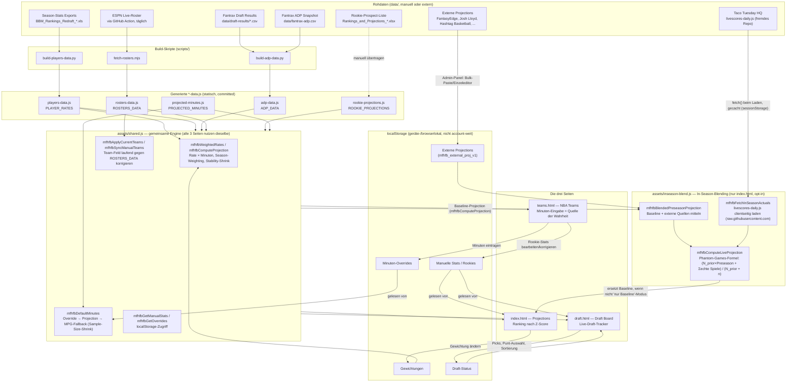

# MFHFBs NBA Projections

### 🔗 [Live-Seite ansehen](https://pizzaratops.github.io/MFHFBs-NBA-Projections/)

*(Link ist aktiv, sobald GitHub Pages im Repo eingeschaltet ist: Settings → Pages → Branch `main` → Root. Bis dahin führt er ggf. noch ins Leere.)*

---

Eigenständige Testseite für Beyaz' manuelle Dynasty-Projektionsmethodik:
Pro-Minute-Produktion der letzten Saison(s) hochrechnen auf projizierte
Minuten für die kommende Saison — live im Browser, ohne Excel.

## Project Brief

**Was das hier ist:** Eine private, statisch gehostete (GitHub Pages)
Fantasy-Basketball-Toolseite für die eigene 9-Cat-H2H-Dynasty-Liga
"MFHFB". Kein Produkt für Dritte — Beyaz ist gleichzeitig einziger
Nutzer, Datenpfleger und "Product Owner". Ziel ist, Excel für die
laufende Saisonarbeit (Projektionen, Rosterplanung, Live-Draft)
komplett zu ersetzen, ohne die manuelle Methodik hinter den Zahlen
aufzugeben — alle Berechnungen bleiben nachvollziehbar und lokal
anpassbar, nichts ist eine Blackbox.

**Kernidee:** Realstatistiken der letzten Saison(s) werden auf
Pro-Minute-Raten runtergerechnet, mit einstellbarer Jahresgewichtung
kombiniert und auf projizierte Minuten für die kommende Saison
hochgerechnet. Daraus entstehen 9-Cat-Z-Scores, die auf drei Seiten
verwendet werden:

- **Projections** (`index.html`) — Ranking aller Spieler nach Z-Score.
  Zeigt eigene Projektion, wahlweise geblendet mit externen Quellen
  und/oder Live-Season-Daten (siehe "In-Season-Blending & externe
  Quellen" unten), im Vergleich zu Realwerten der letzten Saison.
- **NBA Teams** (`teams.html`) — Kader pro Team, Minuten-Eingabe
  (Quelle der Wahrheit für Projektionsminuten), aktueller Kader vs.
  End-Rotation der Vorsaison.
- **Draft Board** (`draft.html`) — Live-Draft-Tracker: Spielerpool nach
  Z-Score **oder ADP** sortierbar, Punt-Kategorien, Kategorie-Ranks des
  eigenen Kaders, Team-vs-Team-Matrix, Empfehlungen nach Kaderschwäche,
  Pick-Log. Läuft komplett gegen dieselbe Projektions-Engine wie die
  Projections-Seite.

**Datenphilosophie:** Rohdaten (Season-Stats, Draft Results, Roster)
leben als Dateien in `data/`. Kleine, dokumentierte Build-Skripte
(`scripts/*.py`, `scripts/*.mjs`) wandeln sie in statische
JS-Datendateien (`*-data.js`) um, die die Seiten laden. Kein Backend,
keine Datenbank — neue Daten rein = Skript laufen lassen = neue
`.js`-Datei committen. Wiederkehrende externe Quellen (NBA-Roster) sind
per GitHub Action automatisiert; alles, was aus manuellen Exports kommt
(Season-Rankings, Fantrax Draft Results), wird bei Bedarf per Skript
neu gebaut.

**Tech-Stack:** Reines HTML/CSS/Vanilla-JS (keine Frameworks, kein
Build-Step für die Seiten selbst), Python (`pandas`) und Node.js für
die Build-Skripte, `localStorage` für alles Nutzerspezifische
(Minuten-Overrides, Gewichtungen, Draft-Fortschritt, Theme) — geräte-
und browserweit, nicht account-weit.

**Stand:** aktive Baustelle, kein fertiges Produkt. Features werden
iterativ ergänzt, sobald sie in der eigenen Liga-Praxis gebraucht
werden (siehe Changelog unten).

## Architektur & Datenfluss

### Flowchart



### Grundidee in einem Satz

Realstatistiken werden auf Pro-Minute-Raten runtergerechnet, mit
Jahresgewichtung kombiniert, auf projizierte Minuten hochgerechnet und
zu 9-Cat-Z-Scores verdichtet — alle drei Seiten sind nur verschiedene
Ansichten auf **dieselbe** Engine (`assets/shared.js`) und **dieselben**
Rohdaten, nicht drei getrennte Systeme.

### Datenquellen im Detail

| Datei | Quelle | Build | Update-Rhythmus |
|---|---|---|---|
| `players-data.js` (`PLAYER_RATES`) | BBM-Redraft-Exports mehrerer Saisons | `scripts/build-players-data.py` | bei Bedarf, wenn neue Saison-Exports vorliegen |
| `projected-minutes.js` (`PROJECTED_MINUTES`) | manuelle Recherche (Rotationsprognosen) | Hand-gepflegt | vor Saisonstart / bei größeren Rollen-Änderungen |
| `rookie-projections.js` (`ROOKIE_PROJECTIONS`) | Rookie-Prospect-Xlsx | manuell übertragen, `ROOKIE_PROJECTIONS_VERSION` bei inhaltlichen Korrekturen hochzählen | einmalig pro Draft-Klasse, Korrekturen bei Bedarf |
| `adp-data.js` (`ADP_DATA`) | `data/draft-results/*.csv` (eigene Ligen) + `data/fantrax-adp.csv` (Fantrax-Snapshot) | `scripts/build-adp-data.py` | nach jedem neuen Draft-Result-Export |
| `rosters-data.js` (`ROSTERS_DATA`) | ESPN API | `scripts/fetch-rosters.mjs`, **täglich automatisch** via GitHub Action | täglich |

`PLAYER_RATES`/`ROOKIE_PROJECTIONS` tragen jeweils ein **statisches**
`team`-Feld (Stand zum Build-Zeitpunkt bzw. Pre-Draft-Schätzung). Damit
das nicht veraltet (Trades, Waives, Signings, Rookie tritt echtem Team
bei), gleichen `mfhfbApplyCurrentTeams()` und `mfhfbSyncManualTeams()`
es bei jedem Seitenaufruf gegen die tagesaktuellen `ROSTERS_DATA` ab —
außer auf `teams.html`s rechter Spalte, die bewusst die historische
Vorsaison-Zuordnung zeigt.

### Die drei Seiten

**`index.html` — Projections.** Reine Rangliste, alle Spieler nach
Z-Score. Zeigt eigene Projektion und Realwerte der letzten Saison
nebeneinander. Hier werden Jahresgewichtungen justiert
(`mfhfbGetWeights()`/`mfhfbSetWeights()`, bis zu 2× für die letzten
zwei Saisons). Zusätzlich Panel "Live & externe Quellen": Live-Status
der aktuellen Saison, und (hinter dem Admin-Lock) Bulk-Import/
Einzeleditor für externe Projections plus "Nur Baseline zeigen"-Schalter
— Details siehe eigener Abschnitt unten. 🔗/🏀-Badge neben dem
Spielernamen öffnet den Vergleich Baseline → +Quellen → Live →
Season-Schnitt.

**`teams.html` — NBA Teams.** Kader pro Team (linke Spalte = aktueller
ESPN-Kader, rechte Spalte = tatsächliche End-Rotation der Vorsaison,
bewusst unterschiedliche Quellen). Hier werden Minuten eingetragen
(`mfhfbGetOverrides()`/`mfhfbSetOverrides()`) — das ist die **einzige
Stelle**, an der Projektionsminuten von Hand gesetzt werden, alle
anderen Seiten lesen diese Overrides nur. Rookie-Stats werden hier
ebenfalls gepflegt (`ROOKIE_PROJECTIONS` wird beim ersten Aufruf nach
einer Versions-Änderung automatisch neu eingespielt, siehe
`ROOKIE_PROJECTIONS_VERSION`).

**`draft.html` — Draft Board.** Live-Draft-Tracker, läuft gegen
dieselbe Engine, plus draft-spezifische Zusatzschicht:
- **Z / Z-Floor / Z-Depth / Z-Punt** — Standard-Score, Score ohne
  schwächste/stärkste Kategorie, Score mit gepunkteten Kategorien auf
  Gewicht 0 (Basketball-Monster-"Punt-Columns"-Prinzip).
- **FG%/FT%** fließen volumen-gewichtet ein (Impact = eigene Quote
  minus Liga-Schnitt, mal eigene Versuche), nicht als rohe Quote —
  sonst verzerren Kleinst-Stichproben (1/1 = 100%) das Ranking.
- **H-Score (Beta)** — vereinfachte Umsetzung von Rosenof (2024)
  H-Scoring: simuliert den Rest-Draft in echter Snake-Reihenfolge über
  bis zu 2 gepuntete Kategorien, schätzt Kategorie-Gewinnwahrscheinlich-
  keit gegen die Liga. Nur für die Top-Kandidaten berechnet
  (Performance), Punt-Auswahl der Chips beeinflusst H-Score NICHT — es
  sucht selbst die beste Strategie pro Kandidat.
- **Scarcity** — Runden-Cliff pro Kategorie: wie schnell dünnt der
  verfügbare Pool in einer Kategorie aus.
- **Punt-Planer** — simuliert Wochen-Matchups gegen alle Gegner unter
  der aktuellen Punt-Auswahl, erkennt mögliche Mirror-Punter.
- **Stat-Filter** — Barttorvik-artige Mehrfachbedingungen (z.B. FG%>50
  UND AST>5,5), kombinierbar mit Positions-Filter.
- **ADP-Popover** — Klick auf die ADP-Zelle zeigt alle einzelnen
  Draft-Positionen aus den eigenen Ligen, nicht nur den Durchschnitt.
- Live-Sync mit Fantrax (`assets/fantrax-live.js`) ordnet echte Picks
  per normalisiertem Namens-Lookup den lokalen Spieler-Zeilen zu.

### Gemeinsamer Speicher (localStorage, browser-/gerätelokal)

| Key | Gesetzt auf | Gelesen von | Inhalt |
|---|---|---|---|
| `mfhfb_proj_minutes_v1` | teams.html | alle 3 Seiten | Minuten-Overrides pro Spieler |
| `mfhfb_manual_stats_v1` | teams.html (Rookie-Seed + Edits) | alle 3 Seiten | manuelle/Rookie-Statzeilen |
| `mfhfb_proj_weights_v1` | index.html | alle 3 Seiten | Jahresgewichtung (Season-Weighting) |
| `mfhfb_cat_weights_v1` | draft.html-Einstellungen | draft.html | Kategorie-Gewichte für Z-Score |
| `mfhfb_zscore_pool_v1` | index.html/draft.html | alle 3 Seiten | Pool-Größe für Z-Mittelwert/Streuung |
| `mfhfb_team_order_v1` | teams.html (Drag&Drop) | teams.html | Sortierreihenfolge pro Team-Karte |
| `mfhfb_rookie_seed_version` | teams.html | teams.html | Versions-Marker fürs Rookie-Reseeding |
| `mfhfb_draft_state_v1` | draft.html | draft.html | Picks, Punt-Auswahl, Sortierung, Filter |
| `mfhfb_live_sync_v1` | draft.html | draft.html | gespeicherte Fantrax-Liga-IDs |
| `mfhfb_admin_v1` | teams.html | teams.html, index.html | Admin-Lock (Minuten-Bearbeitung + externe Quellen) |
| `mfhfb_theme_v1` | alle 3 Seiten | alle 3 Seiten | Hell/Dunkel-Modus |
| `mfhfb_external_proj_v1` | index.html (Admin-Bereich) | index.html | externe Projections pro Spieler/Quelle/Kategorie |
| `mfhfb_inseason_priors_v1` | index.html (falls justiert) | index.html | N_prior-Overrides fürs In-Season-Blending, pro Kategorie |

Zusätzlich `sessionStorage` (nur Tab-Sitzung, kein `localStorage`):
`mfhfb_inseason_actuals_cache_v1` — gecachte Season-Actuals aus dem
Taco-Tuesday-HQ-Live-Feed, max. 6h alt (siehe In-Season-Blending-Abschnitt).

Alles geräte-/browserlokal, nicht account- oder cloudweit — auf einem
anderen Gerät/Browser startet alles wieder mit den `*-data.js`-Defaults.

## Wie die Berechnung funktioniert

1. **Rohdaten** (`data/`): Season-Per-Game-Stats-Export (z.B. aus BBM).
2. **Build-Skript** (`scripts/build-players-data.py`) rechnet jede Stat-Kategorie
   auf eine Pro-Minute-Rate runter: `Rate = Stat/Spiel ÷ Minuten/Spiel`.
3. **`players-data.js`** enthält das Ergebnis als JS-Array, das `index.html`
   und `teams.html` laden.
4. **Roster-Skript** (`scripts/fetch-rosters.mjs`) zieht 1x täglich (via
   GitHub Action) die aktuellen Kader aller 30 Teams von ESPN und schreibt
   sie nach `rosters-data.js`.
5. Auf der **Teams-Seite** (`teams.html`) trägst du pro Spieler projizierte
   Minuten ein — landet in `localStorage`, geteilt mit `index.html`.
6. Die **Projections-Seite** (`index.html`) zeigt links deine Projektion
   (Rate × deine Minuten) und rechts die realen Season-Averages zum
   Vergleich, live sortierbar/rankbar.

## Nutzung

```bash
# Rohdaten aller Saisons neu einlesen und players-data.js neu bauen
cd scripts
python3 build-players-data.py ../players-data.js \
  2018-19=../data/Player_Rankings_18-19.xls \
  2019-20=../data/Player_Rankings_19-20.xls \
  2020-21=../data/Player_Rankings_20-21.xls \
  2021-22=../data/Player_Rankings_21-22.xls \
  2022-23=../data/Player_Rankings_22-23.xls \
  2023-24=../data/Player_Rankings_23-24.xls \
  2024-25=../data/Player_Rankings_24-25.xls \
  2025-26=../data/Player_Rankings_25-26.xls

# Aktuelle Roster von ESPN ziehen (Node >= 18, keine Abhängigkeiten)
node fetch-rosters.mjs

# ADP aus Fantrax Draft Results + Fantrax-ADP neu berechnen (liest ALLE
# CSVs aus data/draft-results/ und die einzelne data/fantrax-adp.csv,
# keine Argumente nötig)
python3 build-adp-data.py
```

**ADP-Workflow (zwei unabhängige Quellen):**
- **Eigene Draft Results** (Spalte "ADP"): Fantrax-Export ("Draft Results" →
  CSV) einfach in `data/draft-results/` ablegen (Dateiname egal,
  H2H/Roto/Points gemischt ist ok, beliebig viele Dateien — mehr Ligen
  = akkurater) und `build-adp-data.py` laufen lassen. Oder die CSV
  direkt im GitHub-Web-UI hochladen, dann übernimmt die GitHub Action
  `update-adp.yml` den Rebuild automatisch.
- **Fantrax-ADP** (Spalte "F-ADP"): Fantrax' eigener aktueller
  ADP-Snapshot, gleiches CSV-Format, aber als **genau eine** Datei unter
  `data/fantrax-adp.csv` — bei einem Update diese Datei einfach
  überschreiben (nicht zusätzliche Dateien anlegen, wird nicht
  gemittelt, sondern 1:1 übernommen).

**Automatischer Fetch statt manuellem CSV-Export (empfohlen):**

Fantrax hat eine von Fantrax selbst dokumentierte API ("fxea"), über die
sich Draft Results UND die eigene ADP direkt per League-ID abrufen
lassen — auch live während ein Draft läuft. Statt CSVs manuell zu
exportieren/hochzuladen, kannst du deine Liga-IDs einmalig eintragen
und den Rest automatisieren:

1. `data/fantrax-leagues.json` öffnen, deine League-IDs eintragen (aus
   der Fantrax-URL: `fantrax.com/fantasy/league/`**`ABC123XYZ`**`/...`)
   ```json
   {
     "sport": "NBA",
     "leagues": [
       { "id": "ABC123XYZ", "label": "H2H 01" },
       { "id": "DEF456UVW", "label": "Points 01" }
     ]
   }
   ```
2. Lokal testen: `node scripts/fetch-draft-results.mjs` (Node ≥ 18,
   keine Abhängigkeiten) — schreibt automatisch CSVs nach
   `data/draft-results/Fantrax-Draft-Results-AUTO-*.csv` und
   überschreibt `data/fantrax-adp.csv`, exakt im selben Format wie ein
   manueller Export. `build-adp-data.py` braucht dafür keine Änderung.
3. Einmal `python3 scripts/build-adp-data.py` hinterher laufen lassen
   wie gewohnt.
4. Für vollautomatischen Betrieb: die GitHub Action
   `fetch-draft-results.yml` läuft 3x täglich (06/14/22 Uhr UTC) und
   bei Bedarf manuell über den Actions-Tab — zieht, baut und committet
   automatisch, sobald Liga-IDs in `data/fantrax-leagues.json` stehen.

**Wichtiger Hinweis:** Diese API ist von Fantrax dokumentiert, aber kein
versioniertes/stabiles Public-API-Produkt — sie kann sich theoretisch
ändern, ohne Vorwarnung. Das Skript loggt bei jedem Schritt ausführlich
und fällt bei mehreren bekannten Endpoint-Varianten automatisch
zurück; falls trotzdem mal etwas nicht mehr passt, reicht ein Blick in
die Konsolen-Ausgabe, um schnell nachzujustieren. Manueller CSV-Export
bleibt als Fallback jederzeit möglich (beide Wege schreiben ins selbe
Verzeichnis/dieselbe Datei).

Neue Saison hinzufügen: einfach eine weitere `<label>=<datei.xls>`-Angabe an
den Befehl anhängen — Reihenfolge der Angaben ist egal, das Skript sortiert
selbst chronologisch anhand des Labels.

Danach `index.html` einfach im Browser öffnen oder per GitHub Pages hosten
(Settings → Pages → Branch `main`, Root-Verzeichnis).

### Live-Sync mit Fantrax (Draft Board, kein eigener Speicher nötig)

Das Draft Board (`draft.html`) kann den aktuellen Draft-Stand einer
Fantrax-Liga **live direkt von Fantrax** laden — per League-ID, ganz
ohne eigenen Speicher/Backend. Fantrax selbst ist die Quelle der
Wahrheit; wir speichern nichts eigenes, sondern fragen bei Bedarf
einfach neu ab. Funktioniert dadurch automatisch auf jedem Gerät
gleich (Handy, Laptop, egal), ohne Sync-Schritt.

*(Frühere Versionen dieser Seite nutzten dafür Firebase/Firestore als
eigenen Cloud-Speicher — das ist inzwischen komplett überflüssig und
wurde entfernt, seit klar ist, dass Fantrax' eigene Draft-Daten direkt
und live abrufbar sind.)*

**Nutzung:** Im Panel "🔗 Live-Sync mit Fantrax" auf `draft.html` die
Liga-ID eintragen (aus der Fantrax-URL:
`fantrax.com/fantasy/league/`**`ABC123XYZ`**`/...`) → "Laden" klicken.
Danach im Dropdown "Welches Team ist deins?" dein eigenes Team
auswählen — das steuert "Mein Team"/Kategorie-Ranks/Empfehlungen wie
gewohnt. Die zuletzt genutzte Liga-ID (+ deine Team-Auswahl je Liga)
wird lokal gemerkt und beim nächsten Öffnen automatisch neu geladen.
Während eines laufenden Drafts kann eine Checkbox "alle 30s automatisch
aktualisieren" aktiviert werden.

**Technischer Hintergrund:** Fantrax hat eine von Fantrax selbst
dokumentierte API ("fxea"), die Draft-Ergebnisse **live während ein
Draft läuft** per League-ID liefert — und (am 22.07.2026 getestet)
**CORS-offen** ist, lässt sich also direkt aus dem Browser heraus
abfragen, ohne Umweg über einen eigenen Server. Genutzt werden:
- `getDraftResults?leagueId=X` — die Picks selbst (`draftPicks[]`,
  `pick` = Overall-Pick-Nummer, `pickInRound` = Pick innerhalb der
  Runde, Picks ohne `playerId` sind noch nicht gefallen)
- `getLeagueInfo?leagueId=X` — Team-Namen
- `getPlayerIds?sport=NBA` — Spieler-ID → Name/Team/Position (Format
  **"Nachname, Vorname"**, wird von `mfhfbFantraxNameToDisplay()` in
  `assets/fantrax-live.js` vor dem Namensabgleich umgedreht)

**Team-Zuordnung:** `draftOrder[]` aus `getDraftResults` listet die
Team-IDs in der Reihenfolge, in der sie in Runde 1 picken — das ist
exakt unsere lokale 1..12-Nummerierung, wird 1:1 übernommen.

**Wichtiger Hinweis:** Diese API ist von Fantrax dokumentiert, aber kein
versioniertes/stabiles Public-API-Produkt — kann sich theoretisch
ändern. `assets/fantrax-live.js` ist bewusst mit ausführlichen
Kommentaren zu den Feldbedeutungen versehen, damit sich ein evtl.
künftiges Format-Update über die Browser-Konsole schnell erkennen und
nachbessern lässt.

### Roster-Automatisierung einrichten

Der Workflow `.github/workflows/update-rosters.yml` läuft automatisch jeden
Tag um 09:00 UTC und committet Änderungen zurück ins Repo. Nach dem
Hochladen einmal manuell testen:

**Actions-Tab → "Update NBA Rosters" → "Run workflow"**

Falls das fehlschlägt: unter **Settings → Actions → General → Workflow
permissions** muss "Read and write permissions" aktiviert sein, sonst darf
die Action nicht zurück committen.

### In-Season-Blending & externe Quellen (`assets/inseason-blend.js`)

Bildet den bisherigen manuellen Excel-Workflow nach: eigene
Minuten-Baseline gegen gefundene externe Projections (FantasyEdge, Josh
Lloyd, Hashtag Basketball, ...) mitteln, und sobald die Saison läuft
laufend gegen echte Spiele nachjustieren — automatisch statt von Hand.

**Zwei unabhängige Bausteine:**

1. **Externe Projections ("Konsens-Layer").** Die reine Minuten-Rate-
   Baseline bleibt immer bestehen (`mfhfbComputeProjection`,
   admin-sichtbar über "Nur eigene Minuten-Baseline zeigen"). Externe
   Quellen werden pro Spieler/Kategorie in `localStorage`
   (`mfhfb_external_proj_v1`) gespeichert und beim Rendern zu einem
   einfachen Mittelwert aus Baseline + allen Quellen geblendet
   (`mfhfbBlendedPreseasonProjection`) — exakt die alte
   "34 + 32 → 33"-Excel-Logik, nur für beliebig viele Quellen
   gleichzeitig. Zwei Eingabewege (beide im Admin-Bereich von
   `index.html`, Panel "Live & externe Quellen"):
   - **Bulk-Import** — ganze Tabelle aus Excel/Sheets reinkopieren
     (Komma oder Tab getrennt, Header-Zeile mit beliebiger Spalten-
     reihenfolge, erkennt Aliase wie `PTS`/`PPG`).
   - **Einzeleditor** — ein Spieler, eine Quelle, Kategorien einzeln.
2. **In-Season-Live-Blending.** Sobald echte Spiele da sind, wird die
   geblendete Preseason-Projection mit den bisherigen Season-Actuals
   nach der Formel
   ```
   neuer_wert = (N_prior × preseason_wert + Σ echte_spiele) / (N_prior + anzahl_spiele)
   ```
   kombiniert (`mfhfbComputeLiveProjection`) — mathematisch identisch zu
   "N_prior Phantom-Spielen mit dem Preseason-Wert". `N_prior`
   ("Phantom-Spiele") ist pro Kategorie kalibriert, abgeleitet aus
   `MFHFB_STABILITY_ALPHA` in `shared.js`: stabile Kategorien (REB/AST/
   BLK) bewegen sich langsam, volatile (STL/FT%) reagieren schneller auf
   echte Daten. Startwerte in `MFHFB_INSEASON_PRIOR_DEFAULTS`, über
   `mfhfbSetInSeasonPrior()` justierbar.

**Datenquelle für (2):** kein eigener Fetch/Backend nötig — der
bestehende tägliche Live-Score-Feed aus dem separaten
**Taco-Tuesday-HQ-Repo** (`data/livescores-daily.js`, dort per eigener
GitHub Action gefüllt) wird clientseitig direkt von
`raw.githubusercontent.com` geladen (`mfhfbFetchInSeasonActuals`,
gecacht in `sessionStorage`, max. alle 6h neu). Der Regular-Season-
League-Key dort ist `"nba"` (`MFHFB_LIVE_LEAGUE` in
`inseason-blend.js`) — vor Saisonstart schlicht leer, dann liefert die
Funktion sauber "keine Live-Daten" statt eines Fehlers.

**Einschränkung:** Die Live-Daten liefern nur FG%/FT%-Quoten pro Spiel,
keine rohen Attempts (FGA/FTA) — Volumen-Gewichtung wie bei der
Preseason-Engine ist für den In-Season-Teil dieser beiden Kategorien
daher nicht möglich, geblendet wird direkt auf der Quote. `fgm`/`ftm`
werden nach jedem Blend-Schritt aus den (unveränderten) Attempts der
Baseline neu abgeleitet, damit Quote und Volumen in derselben Zeile
konsistent bleiben (relevant für die Liga-Schnitt-FG%-Berechnung, die
beides parallel nutzt).

**Vergleich:** Klick auf das 🔗/🏀-Badge neben einem Spielernamen auf
`index.html` öffnet ein Modal mit Baseline / +Quellen / Live / reinem
Season-Schnitt nebeneinander (`mfhfbProjectionComparisonRow`).

**Noch nicht gebaut:** UI für `teams.html`/`draft.html` (Engine ist dort
per `<script>`-Include verfügbar, aber ungenutzt), Rolling-Window/
Recency-Gewichtung statt kumulativem Season-Schnitt, automatisches
Tracking der Preseason-vs-Actual-Abweichung pro Kategorie zur
Kalibrierung der `N_prior`-Werte über mehrere Saisons.

## Struktur

```
index.html                     Projections-Seite (2 Spalten: meine Projektion vs. Realwerte)
teams.html                     NBA-Teams-Seite (Minuten-Eingabe pro Team)
draft.html                     Draft Board (Live-Draft-Tracker, Z- und ADP-Sortierung)
assets/shared.js               gemeinsame Logik (Name-Matching, Storage, Gewichtung)
assets/fantrax-live.js         Live-Sync mit Fantrax fürs Draft Board (fxea-API, direkt im Browser, kein Backend)
assets/inseason-blend.js       In-Season-Blending-Engine (externe Quellen + Live-Actuals von Taco Tuesday HQ), aktuell nur index.html
players-data.js                generierte Pro-Minute-Raten (Output von build-players-data.py)
rosters-data.js                generierte Team-Kader (Output von fetch-rosters.mjs, täglich aktualisiert)
adp-data.js                    generierte ADP-Daten (Output von build-adp-data.py)
scripts/build-players-data.py  Konvertierungsskript Rohdaten → players-data.js
scripts/fetch-rosters.mjs      Roster-Fetcher (ESPN) → rosters-data.js
scripts/build-adp-data.py      Konvertierungsskript Draft Results → adp-data.js
scripts/fetch-draft-results.mjs  Zieht Draft Results + Fantrax-ADP direkt per League-ID (ersetzt manuellen CSV-Export)
.github/workflows/update-rosters.yml  tägliche GitHub Action für den Roster-Fetch
.github/workflows/update-adp.yml      GitHub Action: baut adp-data.js bei neuen CSVs in data/draft-results/
.github/workflows/fetch-draft-results.yml  GitHub Action: zieht Draft Results/ADP 3x täglich direkt von Fantrax
data/                          Rohdaten-Exports (Season-Stats)
data/draft-results/            Fantrax "Draft Results"-CSV-Exporte (Rohdaten für eigenen ADP, beliebig viele)
data/fantrax-adp.csv           Fantrax' eigener ADP-Snapshot (genau eine Datei, wird bei Updates überschrieben)
data/fantrax-leagues.json      Liga-IDs für den automatischen Fantrax-Fetch (scripts/fetch-draft-results.mjs)
```

## Aktueller Stand

- **Saisons geladen:** 2018–19 bis 2025–26, 8 Saisons durchgehend
  (1.278 Spieler gesamt, nicht jeder Spieler hat in jeder Saison Daten).
  Lücke bei 2017–18, für später vorgemerkt.
- **Gewichtung:** Zwei aktive Slider auf der Seite ("vorletztes Jahr" /
  "letztes Jahr", Stufen 1 / 1,25 / 1,5 / 1,75 / 2). Für jeden Spieler
  gelten die beiden **jüngsten Saisons, in denen er Daten hat** als
  "letztes" bzw. "vorletztes" Jahr — ältere Saisons zählen automatisch fix
  mit Gewicht 1.
- **Roster-Automatisierung:** täglicher ESPN-Fetch via GitHub Action —
  noch nicht live getestet (siehe unten, "Roster-Automatisierung
  einrichten"), da ich von hier aus nicht direkt ins Repo pushen/Actions
  auslösen kann. Erster Lauf sollte manuell über den Actions-Tab geprüft
  werden.
- **NBA-Teams-Seite:** neu, zeigt alle Spieler nach Team gruppiert, mit
  Minuten-Eingabe. Ordnet ESPN-Rosternamen den BBM-Ratennamen über einen
  normalisierten Namensabgleich zu (Akzente/Punkte/Jr.-Suffixe werden
  ignoriert) — bei Uneindeutigkeiten wird der Spieler als "keine
  Rate-Daten" markiert statt falsch gematcht.
- **Zwei-Spalten-Ansicht** auf der Projections-Seite: links deine
  Projektion (editierbar nur noch über die Teams-Seite), rechts die realen
  Season-Averages der Saison 2025–26 als Referenz.
- **In-Season-Blending & externe Quellen:** gebaut und deploybar (siehe
  eigener Abschnitt oben), aber noch nicht scharf im Live-Betrieb
  getestet, weil die 2026–27-Saison noch nicht läuft. Der
  Regular-Season-Live-Feed aus Taco Tuesday HQ liefert aktuell nur
  Summer-League-Daten (Key `"nba"` in `livescores-daily.js` existiert
  erst ab Saisonstart) — Panel zeigt bis dahin korrekt "Vorsaison" an.
  Externe Quellen können schon jetzt eingespeist werden, sobald sie
  auftauchen.
- **Live-Reranking:** Minuten-Änderungen auf der Teams-Seite aktualisieren
  die Projections-Tabelle automatisch (per `storage`-Event, wenn beide
  Seiten offen sind; sonst beim nächsten Laden).
- **Live-Sync (Draft Board):** Liga-ID rein, Draft-Stand kommt live von
  Fantrax (`assets/fantrax-live.js`) — kein eigener Speicher/Backend
  mehr (löst die frühere Firebase/Firestore-Lösung ab, siehe
  Changelog). Board ist fest für 12-Team/14-Runden-Ligen gebaut;
  abweichende Liga-Größen werden geladen, aber mit Konsolen-Warnung,
  da die Team-Zuordnung dann ungenau sein kann.
- **ADP im Draft Board:** zwei unabhängig sortierbare Spalten neben
  Z-Score. "ADP" = eigene Fantrax Draft Results (`data/draft-results/`,
  aktuell 203 Spieler aus 8 Ligen). "F-ADP" = Fantrax' eigener
  ADP-Snapshot (`data/fantrax-adp.csv`, aktuell 600 Spieler, wird bei
  Updates einfach überschrieben statt gemittelt). Spieler ohne Wert in
  einer Spalte fallen dort automatisch ans Ende (Fallback auf Z-Score
  untereinander).
- **Rookies:** noch kein automatischer Pfad — Minuten + Rate werden vorerst
  manuell eingetragen.
- **Noch nicht bei TTHQ integriert** — bewusst als eigenständiges Repo, bis
  die Methodik stabil ist.

## Bekannte Einschränkungen

- Die ESPN-Roster-API ist inoffiziell/unbekannt und kann sich ohne
  Vorwarnung ändern. Das Fetch-Skript ist defensiv geschrieben (mehrere
  Wiederholungsversuche, Fallback-Teamliste), aber noch nicht gegen einen
  echten täglichen Lauf getestet.
- `localStorage` ist geräte-/browserweit, nicht account-weit — auf einem
  zweiten Gerät siehst du nicht automatisch dieselben Minuten-Einträge.
- Die rechte "Realwerte"-Spalte zeigt aktuell **2025-26**-Zahlen (die
  letzte abgeschlossene Saison), nicht 2026-27, da diese Saison noch
  nicht läuft.

## Changelog

### 2026-07-26 (18)
- **In-Season-Blending-Engine + externe Projections** (neu:
  `assets/inseason-blend.js`, verkabelt in `index.html`, Script-Include
  auch in `teams.html`/`draft.html` für spätere Nutzung):
  - Bildet den bisherigen manuellen Excel-Workflow nach: eigene
    Minuten-Baseline gegen externe Quellen mitteln
    (`mfhfbBlendedPreseasonProjection`), dann während der Saison laufend
    gegen echte Spiele nachjustieren
    (`mfhfbComputeLiveProjection`) — Formel:
    `(N_prior × preseason + Σ echte_spiele) / (N_prior + n)`, `N_prior`
    pro Kategorie aus `MFHFB_STABILITY_ALPHA` abgeleitet (stabile Kats
    bewegen sich langsam, volatile schneller).
  - Externe Quellen: Bulk-Paste-Import (Excel/Sheets-CSV/TSV,
    Header-Erkennung mit Aliasen) + Einzeleditor pro Spieler, beide im
    neuen Admin-Panel "Live & externe Quellen" auf `index.html`
    (gleicher Admin-Lock wie `teams.html`, jetzt auch dort verfügbar).
  - Live-Actuals kommen ohne eigene Datenpipeline aus dem bereits
    bestehenden täglichen Live-Score-Feed des separaten
    Taco-Tuesday-HQ-Repos (`livescores-daily.js`), clientseitig per
    `fetch()` von `raw.githubusercontent.com` geladen und in
    `sessionStorage` gecacht (max. 6h). Datei ist reines JS-Objektliteral
    (keine quoted keys), daher `new Function`-Auswertung statt
    `JSON.parse` — beim Bauen erst falsch angenommen und gegen die
    echte Datei korrigiert.
  - `fgm`/`ftm` werden nach jedem Blend-Schritt aus den unveränderten
    Attempts neu abgeleitet, damit FG%/FT%-Quote und Volumen in
    derselben Zeile konsistent bleiben (Live-Daten liefern nur Quoten,
    keine FGA/FTA).
  - Vergleichs-Feature: 🔗/🏀-Badge neben dem Spielernamen öffnet Modal
    mit Baseline vs. +Quellen vs. Live vs. Season-Schnitt
    (`mfhfbProjectionComparisonRow`).
  - Getestet: Blend-Formeln per Unit-Tests (Node, gemockte
    Browser-Globals), reales Parsing/Aggregieren gegen die echte
    Taco-Tuesday-HQ-Datei (116 Spieler aus Summer-League-Daten korrekt
    aggregiert), und ein voller Headless-DOM-Smoke-Test des produktiven
    `index.html` (jsdom + `vm.runInContext`, um mehrere `<script>`-Tags
    inkl. `const`/`let`-Bindungen realistisch nachzubilden) — 983
    Spieler gerendert, Bulk-Import, Blend-Mathematik, Vergleichsmodal
    und Baseline-Toggle alle verifiziert.
  - Ein Verschachtelungsfehler beim ersten Einbau (fehlendes öffnendes
    `<div class="toolbar">`, dadurch Tabelle ohne Rahmen/randlos) wurde
    im Nachgang gefunden und gefixt.
  - Noch offen: UI auch für `teams.html`/`draft.html`, Rolling-Window
    statt kumulativem Season-Schnitt, automatisches Tracking der
    Preseason-vs-Actual-Abweichung zur `N_prior`-Kalibrierung über
    mehrere Saisons.

### 2026-07-22 (17)
- **Firebase/Firestore komplett entfernt, ersetzt durch Live-Sync direkt
  mit Fantrax.** Grund: Fantrax hat eine (von Fantrax dokumentierte,
  CORS-offene) API, die den kompletten Draft-Stand einer Liga live per
  League-ID liefert — ein eigener Cloud-Speicher für "meine Picks" war
  dadurch von Anfang an unnötig, Fantrax ist ja schon die Quelle der
  Wahrheit.
  - `assets/firebase-sync.js` gelöscht, Firebase-SDK-`<script>`-Tags aus
    `draft.html` entfernt.
  - Neue Datei `assets/fantrax-live.js`: `getDraftResults`,
    `getLeagueInfo`, `getPlayerIds` direkt im Browser abgefragt (kein
    Backend, keine GitHub Action nötig für diesen Teil).
  - Draft-Board-Panel umgebaut: aus "☁️ Meine Ligen" (10 Firebase-Slots)
    wurde "🔗 Live-Sync mit Fantrax" (ein Liga-ID-Feld + Team-Auswahl).
    Zuletzt genutzte Liga-ID + Team-Wahl je Liga wird lokal gemerkt und
    beim nächsten Öffnen automatisch neu geladen — kein "Speichern"
    mehr nötig, weil nichts Eigenes mehr gespeichert wird.
  - Zwei Format-Eigenheiten der Fantrax-API entdeckt und behandelt:
    Spielernamen kommen als "Nachname, Vorname" (wird vor dem
    Namensabgleich umgedreht), und das Feld `pick` in den draftPicks ist
    die Overall-Pick-Nummer (nicht Pick-in-Runde — das ist
    `pickInRound`).
  - Optionale Auto-Aktualisierung alle 30s, solange ein Draft laut
    Fantrax `running` ist.
  - Getestet mit echten Live-Daten des Nutzers (Konsolen-Abfrage einer
    laufenden Liga) — Namensauflösung und Team-Zuordnung funktionieren
    nachweislich korrekt.

### 2026-07-22 (16)
- **Automatischer Draft-Results/ADP-Fetch direkt von Fantrax** (löst
  manuellen CSV-Export/Upload als Standardweg ab, der bleibt aber als
  Fallback funktionsfähig):
  - Neues Skript `scripts/fetch-draft-results.mjs`: nutzt Fantrax'
    eigene (von Fantrax dokumentierte) "fxea"-API, um Draft Results und
    Fantrax-ADP direkt per League-ID zu ziehen — auch live während ein
    Draft noch läuft. Fällt bei mehreren dokumentierten
    Endpoint-Varianten automatisch zurück (`getDraftResults` →
    `getDraftPicks`; `getAdp` per GET → POST), loggt dabei ausführlich.
  - Schreibt Ergebnisse in exakt demselben CSV-Format wie ein manueller
    Fantrax-Export → `build-adp-data.py` brauchte dafür KEINE Änderung,
    beide Wege laufen in dieselbe Pipeline.
  - Neue Konfigurationsdatei `data/fantrax-leagues.json`: einfache
    Liste von League-IDs + Label, ist die einzige Stelle, die bei einer
    neuen Liga gepflegt werden muss.
  - Neue GitHub Action `fetch-draft-results.yml`: läuft automatisch 3x
    täglich (06/14/22 Uhr UTC) + manuell auslösbar, zieht/baut/committet
    ohne Zutun.
  - Getestet mit gemocktem Fantrax-API-Response (echte Live-Verbindung
    ließ sich aus der Entwicklungsumgebung heraus nicht direkt prüfen,
    daher zusätzliche Robustheit: Fallbacks, ausführliches Logging,
    sauberes Überspringen unbekannter Spieler-IDs statt Absturz) —
    finaler Live-Test mit echter League-ID steht noch aus.

### 2026-07-22 (15)
- **Cloud-Sync für Draft Board hinzugefügt:** neues Panel "☁️ Meine
  Ligen" auf `draft.html` mit 10 benannten Speicher-Slots (Firebase
  Firestore, anonyme Auth). Jeder Slot: Name, Speichern/Laden/Löschen,
  Zeitstempel des letzten Speicherns. Ermöglicht geräteübergreifendes
  Arbeiten (z.B. Pick am Handy machen, am Laptop weitermachen mit
  demselben Liga-Stand) — bisher war der Draft-Fortschritt rein
  `localStorage`-basiert und damit an ein Gerät/einen Browser gebunden.
  - Neue Datei `assets/firebase-sync.js`: Firebase-Init, anonyme
    Anmeldung, Save/Load/List/Delete für die 10 Slots. Ohne ausgefüllte
    `MFHFB_FIREBASE_CONFIG` bleibt die Seite normal nutzbar (lokaler
    Fortschritt wie bisher), das Panel zeigt dann nur einen Hinweis
    statt der Slots — kein Hard-Fail.
  - Setup-Anleitung fürs eigene Firebase-Projekt (kostenlos, ca. 5 Min.)
    im README-Abschnitt "Cloud-Sync einrichten", inkl. der nötigen
    Firestore-Security-Rules.
  - Gespeichert wird ein Snapshot aus Picks, Punt-Kategorien,
    Such-/Positionsfilter und Sortier-Einstellung — exakt der Zustand,
    der auch lokal in `localStorage` liegt.
  - "Laden" fragt vorher explizit nach Bestätigung (überschreibt den
    aktuell angezeigten, ggf. ungespeicherten Draft-Stand).
  - Sicherheitsmodell bewusst pragmatisch (wie der bestehende
    Admin-Lock): Firestore-Regeln verlangen nur "irgendeine anonyme
    Anmeldung", kein Passwort/Benutzerkonto — ausreichend für private
    Fantasy-Draft-Picks, kein echter Zugriffsschutz.

### 2026-07-22 (14)
- **Fantrax-ADP als zweite, unabhängige Spalte ergänzt** ("F-ADP", neben
  "ADP" für die eigenen Draft Results). Bewusst KEINE
  Fallback-Verschmelzung zu einem Wert — beide Spalten sind einzeln
  sortierbar, damit direkt sichtbar bleibt, welcher Wert woher kommt.
  - Neue Datei `data/fantrax-adp.csv` (genau eine, kein Ordner — anders
    als die Draft-Results): Fantrax' eigener ADP-Snapshot, wird bei
    einem Update überschrieben statt gemittelt, weil er selbst schon
    ein plattformweiter Durchschnitt ist.
  - `scripts/build-adp-data.py` liest jetzt beide Quellen unabhängig
    ein und führt sie pro Spieler zu `ownAdp`/`fantraxAdp` in
    `adp-data.js` zusammen (Union der Namen aus beiden Quellen, nicht
    nur Schnittmenge).
  - Sortierverhalten identisch zur "ADP"-Spalte: Klick sortiert
    aufsteigend, Spieler ohne Wert in der jeweiligen Spalte fallen ans
    Ende, unabhängig von Sortierrichtung, mit Z-Score-Fallback
    untereinander.
  - Erstbefüllung: 600 Spieler aus einem Fantrax-ADP-Snapshot (Stand
    22.07.2026) → 619 Spieler insgesamt mit mindestens einem ADP-Wert
    (184 mit beiden, 19 nur eigener ADP, 416 nur Fantrax-ADP).

### 2026-07-22 (13)
- **ADP-Spalte im Draft Board hinzugefügt.** Neue, sortierbare Spalte
  neben Z, berechnet als Durchschnitts-Draftposition über beliebig viele
  hochgeladene Fantrax "Draft Results"-Exports.
  - Neuer Ordner `data/draft-results/`: einfach CSV-Exporte reinlegen
    (Dateiname egal, H2H/Roto/Points werden bewusst nicht getrennt,
    sondern zusammen gemittelt — mehr Ligen = akkurater).
  - Neues Skript `scripts/build-adp-data.py`: aggregiert über die
    stabile Fantrax `Player ID` (robust gegen Schreibweisen-Unterschiede),
    schreibt `adp-data.js` mit demselben normalisierten Namensschema wie
    `mfhfbNormalizeName()` — matcht dadurch automatisch gegen
    `PLAYER_RATES`, kein Zusatz-Mapping nötig.
  - Neue GitHub Action `update-adp.yml`: baut `adp-data.js` automatisch
    neu und committet, sobald eine CSV nach `data/draft-results/`
    gepusht wird (auch per direktem Upload im GitHub-Web-UI möglich).
  - Sortierverhalten: Klick auf "ADP" sortiert aufsteigend (bester Pick
    zuerst). Spieler ohne eigenen ADP (noch nicht in genug Draft Results
    erfasst) fallen immer ans Tabellenende, unabhängig von der
    Sortierrichtung; untereinander vorerst Fallback auf Z-Score. Eine
    Fantrax-eigene ADP-Datei ist als zweite Fallback-Stufe vorgesehen,
    sobald diese hochgeladen wird.
  - Erstbefüllung: 8 Draft Results (6× H2H, 2× Roto, je 12 Teams/14
    Runden) → 203 aggregierte Spieler. Victor Wembanyama z.B. ADP 1,2
    (n=8, Range 1–2).

### 2026-07-20 (12)
- **Projizierte Minuten 2026-27 als Standardwerte eingespielt**
  (`projected-minutes.js`, 306 Spieler aus der 30-Team-Recherche). Die
  Minuten-Vorbelegung folgt jetzt der Reihenfolge: manueller Override >
  projizierte Minuten > reale MPG der letzten Saison. 95% der projizierten
  Spieler matchen mit der Rate-Datenbank; der Rest sind Rookies/Neuzugänge
  ohne Rate-Daten (brauchen weiter manuelle Eingabe). Gilt sowohl für die
  Teams-Seite als auch für das Ranking auf der Projections-Seite.
- **Admin-Lock:** Minuten-Eingabe, manuelle Stat-Eingabe und Drag & Drop
  sind jetzt hinter einem **Admin-Button** (oben rechts) gesperrt.
  Standardmäßig ist alles schreibgeschützt (Betrachter können nichts
  versehentlich ändern). Klick auf „🔒 Admin" fragt ein Passwort ab
  (Default `mfhfb`, in `assets/shared.js` änderbar) und schaltet die
  Bearbeitung frei („🔓 Admin aktiv"); erneuter Klick sperrt wieder.
  Ein Hinweistext über der Tabelle zeigt den aktuellen Status.
  **Wichtig:** Das ist eine reine Bedien-Sperre (client-seitig) gegen
  versehentliche Änderungen — kein kryptographischer Schutz, da jeder den
  Quelltext einsehen kann.

### 2026-07-19 (11)
- **Light-Mode-Bug behoben:** Heatmap-Zellen setzten bisher eine feste
  helle Textfarbe (für Dark Mode gedacht) — im Light Mode auf weißem
  Grund praktisch unsichtbar. Heatmap setzt jetzt nur noch die
  Hintergrundfarbe, Text bleibt die normale Theme-Textfarbe. Funktioniert
  jetzt in beiden Themes.
- **Trennlinie nach Reihe 5** (gestrichelt) in der linken Team-Tabelle,
  als visueller Marker für eine Starting 5.
  Reine CSS-Lösung (5. Zeile), unabhängig davon ob die Reihenfolge per
  Drag & Drop angepasst wurde oder nicht.
- **Linke Team-Tabelle kompakter:** Zahlen-Spinner-Pfeile bei den
  Eingabefeldern ausgeblendet (sparen unnötig Platz), Zellen-Padding und
  Eingabefeld-Breiten reduziert. Alle 12 Spalten sollten jetzt im
  Desktop-Modus ohne horizontales Scrollen passen — mobile Ansicht folgt
  später.
- **Standard-Reihenfolge links = wie rechts:** Ohne manuelles Drag & Drop
  sortiert die linke Tabelle jetzt genau wie die rechte — absteigend nach
  den realen Minuten der letzten Saison. Spieler, die in beiden Kadern
  stehen, landen dadurch auf ungefähr derselben Zeile; Zu- und Abgänge
  fallen durch die Verschiebung sofort auf. Eine gespeicherte
  Drag-Reihenfolge hat weiterhin Vorrang vor dieser Standardsortierung.

### 2026-07-19 (10)
- **Manuelle Stat-Eingabe für Rookies/Two-Way-Spieler ohne Rate-Daten:**
  Statt "keine Rate-Daten" gibt es jetzt editierbare Felder für Minuten,
  GP und alle 9 Cats direkt in der Team-Tabelle. Werte werden gespeichert
  und fließen automatisch auch in die Projections-Seite ein (als
  eigenständige Zeile, mit "MANUELL"-Kennzeichnung).
- **Positionsspalte ergänzt** — war bei der letzten Umstrukturierung der
  Team-Seite versehentlich rausgefallen, jetzt wieder da (links und
  rechts, aus ESPN bzw. BBM-Daten).
- **Drag & Drop innerhalb der linken Team-Tabelle:** Reihenfolge lässt
  sich per Ziehen anpassen (kleines ⠿-Handle), z.B. um eine Starting 5
  nach oben zu sortieren. Wird pro Team in `localStorage` gespeichert und
  bleibt über Neuladen hinweg erhalten. Gilt nur für die linke (aktuelle)
  Tabelle, nicht für die rechte Referenz-Spalte.
- **Trade-Frage beantwortet:** Roster-Updates laufen über die tägliche
  GitHub Action; ESPN übernimmt Trades meist noch am selben oder
  nächsten Tag. Bei Bedarf lässt sich der Fetch jederzeit manuell über
  den Actions-Tab anstoßen, statt auf den Cron zu warten.

### 2026-07-19 (9)
- **Projections-Seite aufgeräumt:** "MFHFB · Testseite"-Eyebrow, der lange
  Basis-Text unter der Überschrift und die Info-Box zur Teams-Seite sind
  komplett raus — die Seite wirkt jetzt deutlich schlanker.
- **Light Mode ergänzt** (zusätzlich zu Dark): Toggle-Button oben rechts
  in der Navigation auf beiden Seiten (Projections + Teams). Theme wird
  in `localStorage` gespeichert und beim Laden sofort angewendet (kein
  Flackern durch falsches Theme beim Start). Farbpalette an der
  bestehenden TTHQ-Optik orientiert (gleiche Akzentfarbe, helle statt
  dunkle Flächen).

### 2026-07-19 (8)
- **Realwerte-Spalten von der Projections-Seite entfernt** — die gehören
  ausschließlich auf die Teams-Seite (rechte Spalte pro Team). Projections
  zeigt jetzt nur noch die eigene Projektion + Z-Score, dafür wieder
  schmaler und übersichtlicher.
- **Zubac-Korrektur:** kein Datenfehler — er wurde tatsächlich für den
  #5 Pick zu den Pacers getradet. Der vorherige Hinweis dazu war falsch,
  danke für den Gegencheck.
- **Z-Score-Basis wählbar:** Top 200 / Top 400 / Alle als Ranking-
  Population für die Mittelwert-/Streuungsberechnung der Z-Scores
  (sortiert nach projizierten Punkten). Ändert sichtbar die Z-Scores und
  damit das Ranking — getestet an Jokić: 11,06 (Top 200) vs. 17,71
  (Alle). Auswahl liegt im einklappbaren Gewichtungs-Panel.
- **Bedingte Farbformatierung (Excel-Stil)** auf der Projections-Seite:
  jede Stat-Spalte einzeln von Rot (schlechtester Wert der aktuell
  angezeigten Spieler) bis Grün (bester Wert) eingefärbt, TOV invertiert.
  Neu berechnet bei jeder Sortierung/Suche.
- **Dieselbe Farbformatierung auf der Teams-Seite**, aber pro Team separat
  berechnet (nicht global) — sowohl links (aktueller Kader) als auch
  rechts (End-Rotation), damit der Vergleich innerhalb des Kaders
  aussagekräftig bleibt statt gegen die ganze Liga.

### 2026-07-19 (7)
- **Team-Seite umgebaut:** Missverständnis aus der letzten Runde korrigiert
  — das Zwei-Spalten-Layout ("meine Minuten" vs. "Realwerte") gehört auf
  die Team-Seite, nicht (nur) auf die Projections-Seite. Jedes Team zeigt
  jetzt zwei Tabellen nebeneinander:
  - **Links:** aktueller Kader (ESPN-Fetch) mit editierbaren Minuten,
    9-Cat-Stats hochgerechnet aus den Pro-Minute-Raten der letzten Saison,
    plus GP der letzten Saison als Referenz.
  - **Rechts:** tatsächliche End-Rotation der letzten Saison (aktuell
    2025-26, aus den BBM-Daten gefiltert nach Team) mit echten Minuten,
    echten 9-Cat-Stats und echtem GP — nicht editierbar, dient als
    Vergleich.
- **Team-Kürzel-Mapping ergänzt** (`ESPN_TO_BBM_TEAM`): ESPN und die
  BBM-Exportdateien nutzen teils unterschiedliche Abkürzungen (z.B. ESPN
  "GS" vs. BBM "GSW", "NO" vs. "NOR", "SA" vs. "SAS", "UTAH" vs. "UTA",
  "WSH" vs. "WAS") — ohne Mapping wäre die rechte Spalte für diese Teams
  leer geblieben.
- **Datenqualitäts-Hinweis entdeckt:** In `Player_Rankings_25-26.xls`
  steht Ivica Zubac unter Team "IND" statt "LAC" — vermutlich ein Fehler
  in der Rohdaten-Quelle, nicht im Code. Lohnt sich gegenzuchecken.

### 2026-07-19 (6)
- **Bug behoben:** Spieler, die eine ganze Saison komplett verpasst haben
  (z.B. Haliburton, Lillard 2025-26), wurden bisher so dargestellt, als
  wäre ihre letzte *gespielte* Saison automatisch die aktuellste — dadurch
  stand z.B. bei Haliburton "73 GP" da, wo eigentlich "0 GP (2025-26)"
  hingehört hätte.
- **Build-Skript** trackt jetzt explizit "missed"-Saisons (0 GP) zwischen
  dem Debüt eines Spielers und der insgesamt jüngsten geladenen Saison,
  statt Lücken einfach stillschweigend auszulassen. Saisons vor dem Debüt
  bleiben weiterhin unangetastet (kein "0 GP", weil schlicht nicht
  anwendbar).
- **GP-Kürzel** zeigt jetzt korrekt `0/73/69` statt `73/69/-` für
  Haliburton — die aktuellste (verpasste) Saison steht explizit mit 0 da.
- **Realwerte-Spalte** auf der Projections-Seite zeigt bei einer verpassten
  aktuellsten Saison jetzt "nicht gespielt (2025-26)" statt stillschweigend
  die Vorjahreszahlen unterzuschieben.
- **Team-Seite** markiert Spieler mit verpasster aktuellster Saison jetzt
  mit einem "⚠ pausiert"-Hinweis neben dem Namen.
- **Rate-/Gewichtungsberechnung unverändert korrekt:** floss schon vorher
  nur aus tatsächlich gespielten Saisons ein — eine 0-GP-Saison verzerrt
  die Projektion also nicht künstlich nach unten. Das war kein Bug, nur
  die Anzeige war irreführend.
- Referenzdokument `player-absences-2025-26.md` ergänzt: recherchierte
  Gründe (Verletzung, Rücktritt, Ligawechsel, etc.) für alle relevanten
  Spieler, die 2025-26 fehlen.

### 2026-07-19 (5)
- **Rangnummer** (1., 2., 3., …) links auf der Projections-Seite ergänzt —
  passt sich automatisch der aktuellen Sortierung an.
- **Z-Score** hinzugefügt: kategorienweise über den gesamten Datensatz
  berechnet, mit einstellbaren Kategorie-Gewichtungen kombiniert (TOV
  invertiert, da weniger besser ist), sortierbar wie jede andere Spalte.
  Standard-Sortierung der Seite ist jetzt Z-Score absteigend.
- **Season-Liste unter dem Namen entfernt**, stattdessen kompaktes
  GP-Kürzel der letzten bis zu 3 Saisons (neueste zuerst, `-` wenn eine
  Saison fehlt), z.B. `65/70/-`.
- **Neue Standard-Gewichtung:** vorletzte Saison 1,5×, letzte Saison
  1,75×; Kategorie-Gewichte PTS 0,9 / REB 1 / AST 1 / STL 0,75 / BLK 0,75
  / 3PM 0,75 / TOV 0,25 / FT% 0,9 / FG% 1 (Reset-Button stellt diese
  Werte jederzeit wieder her).
- **Gewichtungs-Panel ist jetzt einklappbar** (standardmäßig eingeklappt,
  um Platz zu sparen).
- **CSV-Export**: Button lädt die aktuell sortierte/gefilterte Tabelle
  (inkl. Rang, Z-Score, Realwerten, GP-Kürzel) als `.csv` herunter.

**Bekannte Vereinfachung:** FG%/FT% fließen als reine Prozentwerte in den
Z-Score ein, nicht volumen-gewichtet ("Impact Score" wie bei manchen
Fantasy-Tools) — ein Spieler mit wenigen, aber sehr genauen Würfen wird
dadurch etwas überbewertet. Kann bei Bedarf nachgebessert werden.

### 2026-07-19 (4)
- **NBA-Teams-Seite** (`teams.html`) hinzugefügt: alle Spieler nach den
  30 NBA-Teams gruppiert, mit Minuten-Eingabe pro Spieler.
- **Roster-Fetcher** (`scripts/fetch-rosters.mjs`) + tägliche **GitHub
  Action** (`.github/workflows/update-rosters.yml`) für automatische
  Kader-Updates von ESPN (bevorzugt, da meist am aktuellsten).
- **Gemeinsames Storage-Modul** (`assets/shared.js`): Minuten werden jetzt
  nur noch auf der Teams-Seite eingetragen und über `localStorage` mit der
  Projections-Seite geteilt (inkl. Name-Matching zwischen ESPN- und
  BBM-Namen).
- **Projections-Seite umgebaut:** zwei Spaltengruppen (meine Projektion /
  reale Season-Averages), Minuten-Felder dort nicht mehr editierbar,
  Live-Reranking bei Änderungen auf der Teams-Seite.

### 2026-07-19 (3)
- 5 weitere Saisons eingespeist: 2018–19, 2019–20, 2020–21, 2021–22, 2022–23
  → jetzt 8 durchgehende Saisons (2018–19 bis 2025–26), 1.278 Spieler.
- Alle Rohdaten stammen aus derselben "Player Rankings"-Exportfamilie (volle
  Makes-Spalten `fg/g`/`ft/g` direkt vorhanden, kein Ableiten nötig) —
  ersetzt die vorher erwogene Nutzung der `BBM_Rankings_Redraft`-Dateien aus
  dem TTHQ-Projekt, die ein leicht anderes Spaltenschema hatten.
- Lücke bei 2017–18 bewusst offen gelassen, kommt später nach.

### 2026-07-19 (2)
- Zwei weitere Saisons eingespeist: 2023–24 und 2024–25 (zusätzlich zu
  2025–26) → jetzt 802 Spieler mit bis zu 3 Saisons Historie.
- Build-Skript auf Mehrjahres-Verarbeitung umgebaut: `players-data.js`
  speichert jetzt pro Spieler ein `seasons`-Objekt mit einer Rate pro
  Saison, statt einer einzelnen Rate.
- Gewichtungs-Slider aktiviert: "vorletztes Jahr" / "letztes Jahr" wirken
  sich jetzt live auf die Berechnung aus (Stufen 1 / 1,25 / 1,5 / 1,75 / 2),
  ältere Saisons zählen fix mit Gewicht 1.
- Live-Link ganz oben im README ergänzt.

### 2026-07-19 (1)
- Erste Testversion: `index.html` + `players-data.js` aus einer Saison
  (2025–26) gebaut.
- Build-Skript (`scripts/build-players-data.py`) erstellt, um zukünftige
  Rohdaten-Updates reproduzierbar einzulesen.
- Gewichtungs-Slider (UI) für zukünftige Mehrjahres-Gewichtung vorbereitet,
  aktuell deaktiviert (nur eine Saison an Daten vorhanden).
